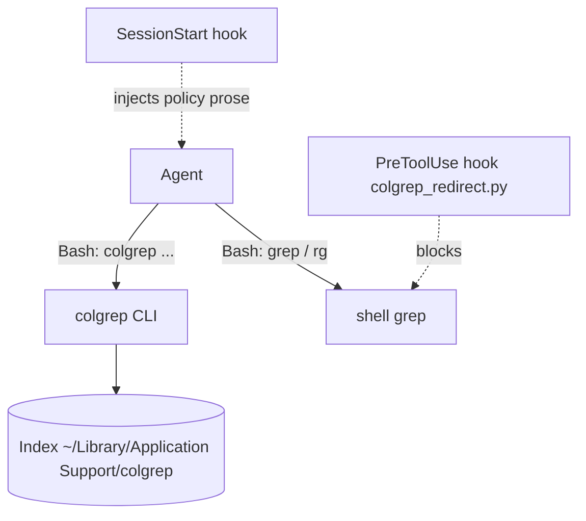
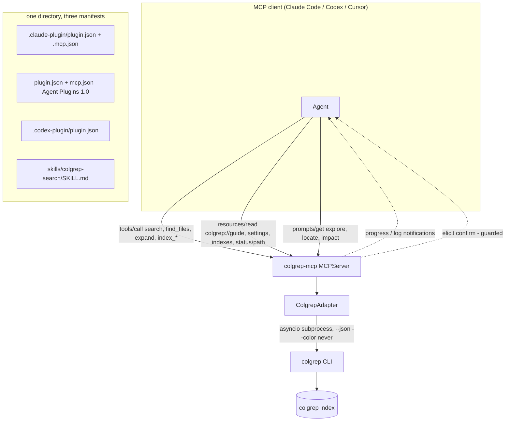
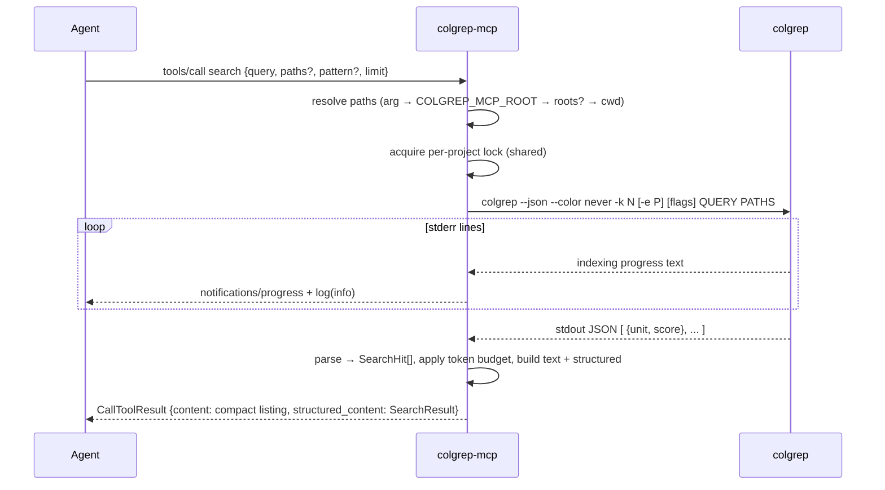
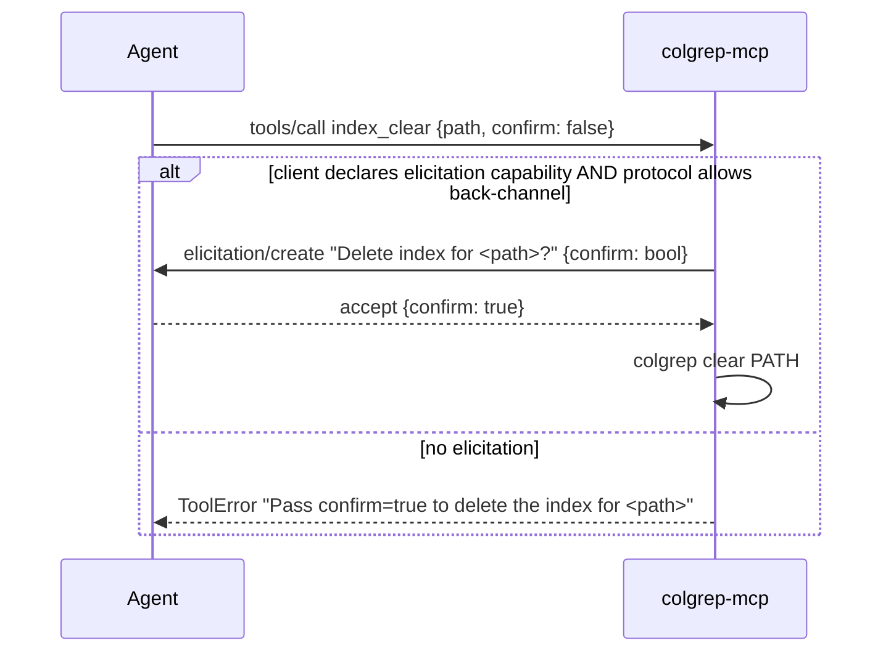

# colgrep-mcp — Architecture Analysis (v0)

Date: 2026-09-11
Author: team lead (Fable 5.1). Consumers: implementation agents, verifier, the PI on waking.

## Executive Summary

- **Problem**: `colgrep` (LightOn `next-plaid`, v1.6.2) gives fast hybrid semantic code search, but it is a CLI. Coding agents are trained to reach for `grep`/`rg` through the shell; months of hooks and prose instructions only partially redirect them. A tool the agent *sees in its tool list* is adopted; a CLI it must remember is not.
- **Proposed change**: a stdio MCP server, `colgrep-mcp`, built on the MCP Python SDK v2 (`mcp>=2.2`, class `MCPServer`), that drives the `colgrep` binary as a subprocess and exposes **agent-first tools** (search, find files, expand hits, index status/build/clear, list indexes, doctor), **resources** (guide, settings, indexes, per-path status), **prompts** (explore / locate / impact workflows) and **completions**. Packaged as a Claude Code plugin, an Agent Plugins 1.0 plugin and a Codex plugin from one directory.
- **Non-goals**: re-implementing indexing or ranking in Python (colgrep owns the index); remote/HTTP deployment in v0.1 (stdio only, HTTP left as a `run()` flag); write access to colgrep global settings (`set-model` wipes every index — humans do that); replacing the user's existing PreToolUse redirect hooks (they stay; the server makes them unnecessary over time).
- **Biggest risks**: (1) cold index builds take minutes and download a model — must stream progress or the client times out; (2) colgrep's non-JSON subcommands (`status`, `--stats`, `settings`) are text we must parse; (3) result payloads can flood the agent's context — hard token budgets are part of the contract; (4) server-initiated features (elicitation, roots) vary by client and protocol revision — every use is capability-guarded.
- **Validation approach**: in-memory `Client(mcp)` tests with a fake colgrep for contracts; a stdio end-to-end run against a real repository for behaviour; `claude plugin validate` for packaging; a findings report with measured latencies.

## Current State



The agent decides per call; the hook fights it after the fact. Semantic search is a habit to enforce, not a capability to pick.

## Proposed State



## Key Flows

### Search with lazy index update



### Destructive operation with guarded elicitation



## Contracts & Invariants

### Naming

- MCP server name: `colgrep`. Version string mirrors `server/pyproject.toml`.
- Python distribution: `colgrep-mcp`; import package `colgrep_mcp`; console script `colgrep-mcp`.
- Tool names are short verbs/nouns without a `colgrep_` prefix (the client already namespaces them, e.g. `mcp__plugin_colgrep-mcp_colgrep__search`).

### Tools

| Tool | Purpose | Key inputs (all optional unless bold) | Output (`structured_content`) | Annotations |
|:--|:--|:--|:--|:--|
| `search` | Ranked semantic / hybrid search over code units | **`query`**; `paths: list[str]`; `pattern` (regex pre-filter, `-e`); `fixed_string`; `whole_word`; `case_sensitive`; `include: list[str]`; `exclude: list[str]`; `exclude_dir: list[str]`; `limit: int|None` (None → exhaustive, no `-k`); `code_only`; `semantic_only`; `alpha: float`; `snippet_lines: int` (default 6); `include_code: bool` (default false); `skip_index_update: bool` | `SearchResult` | read_only, idempotent, open_world=false |
| `find_files` | Which files are about X (ranked, deduplicated) | **`query`**; `paths`; `pattern`; `include`; `exclude`; `exclude_dir`; `limit` | `FileResult` {files: [{file, best_score, hits, top_units}], truncated} | read_only, idempotent |
| `expand` | Full source of hits already returned | **`hit_ids: list[str]`**; `max_lines: int` (default 200) | `ExpandResult` {units: [{hit_id, file, line, end_line, code, truncated}]} | read_only, idempotent |
| `index_status` | Is this project indexed, with what, where | `path` | `IndexStatus` | read_only, idempotent |
| `index_build` | Build or refresh the index now (progress streamed) | `path`; `force_cpu` | `IndexBuildResult` {project, units_indexed, elapsed_ms, log_tail} | read_only=false, destructive=false, idempotent=true |
| `index_clear` | Delete a project's index | `path`; `confirm: bool` (default false) | `IndexClearResult` {project, cleared} | destructive=true |
| `list_indexes` | All indexed projects on this machine | — | `IndexList` {indexes: [IndexInfo]} | read_only |
| `doctor` | Environment self-check | — | `Doctor` {colgrep_path, version, settings, default_root, root_source, ok, problems[]} | read_only |

All tools accept `ctx: Context` and log to the client with `ctx.info` / `ctx.warning`.

**`hit_id` invariant**: `hit_id == f"{absolute_file}:{line}-{end_line}"`. It is self-describing; `expand` needs no server-side cache and survives restarts. `expand` reads those lines from disk (file must still exist; otherwise per-unit error entry, not a tool failure).

**Path resolution invariant** (every path-taking tool): explicit argument → env `COLGREP_MCP_ROOT` → first client root (only if the client declared `roots` and the negotiated protocol has a back-channel; wrapped in try/except for `NoBackChannelError` and deprecation warnings) → server process cwd. The chosen source is reported in `doctor.root_source`. Relative paths are resolved against the default root. Non-existent paths → `ToolError` listing the paths that failed.

**Token-budget invariant**: the text `content` of `search` is a compact listing, one line per hit (`file:line-end  score  unit_type name — signature`), followed by up to `snippet_lines` lines of code per hit, and is capped at `COLGREP_MCP_TEXT_BUDGET` characters (default 12 000). When capped, the text ends with `[N more hits in structured_content; call expand(hit_ids) for code]`. `structured_content` always carries every hit's metadata; `code` is present only when `include_code=true`. `truncated=true` whenever colgrep or the budget dropped anything, and a `ctx.warning` is emitted.

**Concurrency invariant**: an `asyncio.Lock` per resolved project path. `index_build` and `index_clear` hold it exclusively; `search`/`find_files` hold it too (colgrep may auto-update the index) — serialization per project is accepted; different projects run in parallel. A `colgrep` subprocess never runs with a TTY; `--color never` is always passed.

### Pydantic models (signatures only)

```python
class SearchHit(BaseModel):
    hit_id: str; file: str; line: int; end_line: int
    name: str; qualified_name: str; unit_type: str; language: str
    signature: str | None; score: float
    snippet: str | None      # first `snippet_lines` lines
    code: str | None         # only when include_code

class SearchResult(BaseModel):
    query: str; pattern: str | None; paths: list[str]
    hits: list[SearchHit]; total: int; truncated: bool
    elapsed_ms: int; index_updated: bool; notes: list[str]

class IndexStatus(BaseModel):
    project: str; indexed: bool; model: str | None; index_path: str | None
    units_indexed: int | None; search_count: int | None; raw: str

class IndexInfo(BaseModel):
    project: str; model: str; units_indexed: int; search_count: int
```

Raw colgrep hit fields consumed: `unit.name, qualified_name, file, line, end_line, language, unit_type, signature, code` and `score`. Other fields (`calls`, `complexity`, …) are dropped in v0.1 (candidate for a `verbose` flag later).

### Adapter contract (`colgrep_mcp/adapter.py`)

```python
class ColgrepAdapter:
    def __init__(self, binary: str = "colgrep", timeout_s: float = 600, on_stderr: Callable[[str], Awaitable[None]] | None = None)
    async def version(self) -> str
    async def search(self, req: SearchRequest) -> list[RawHit]          # colgrep --json search
    async def status(self, path: Path) -> IndexStatus                    # parse `colgrep status`
    async def stats(self) -> list[IndexInfo]                             # parse `colgrep --stats`
    async def settings(self) -> dict[str, str]                           # parse `colgrep settings`
    async def init(self, path: Path, *, force_cpu=False) -> IndexBuildResult   # colgrep init -y, streams stderr
    async def clear(self, path: Path) -> None                            # colgrep clear PATH
    def build_search_argv(self, req: SearchRequest) -> list[str]         # pure, unit-testable

class ColgrepError(Exception)                 # base
class ColgrepNotFound(ColgrepError)           # binary missing → doctor advice
class ColgrepFailed(ColgrepError)             # non-zero exit: .returncode, .stderr_tail
class ColgrepTimeout(ColgrepError)
class ColgrepParseError(ColgrepError)         # JSON/text parse failure: .raw
```

Subprocess execution uses `asyncio.create_subprocess_exec` (never a shell), stdout fully buffered, stderr consumed line-by-line and forwarded to `on_stderr` (which the tool layer maps to `ctx.report_progress` when a percentage/`n/total` can be parsed, else `ctx.info`). The text parsers live in `colgrep_mcp/textparse.py` and are pure functions over strings, tested against fixtures captured by R03.

### Error model

| Condition | Surface to agent |
|:--|:--|
| colgrep binary missing | `ToolError("colgrep not found on PATH. Install: cargo install colgrep — or set COLGREP_MCP_BINARY")` |
| non-zero exit | `ToolError` with the last 20 stderr lines and the argv (without env) |
| timeout | `ToolError` naming the timeout and suggesting `index_build` first for cold repos |
| bad path | `ToolError` listing unresolved paths and the default root used |
| zero hits | **not an error**: `SearchResult.hits=[]`, `notes=["no units matched; try dropping pattern/include or rephrasing"]` |
| `expand` on a missing file | per-unit `{error: "..."}` entry; tool succeeds |
| destructive op without confirmation and no elicitation | `ToolError` telling the agent exactly which flag to pass |

`ToolError` (from `mcp.server.mcpserver.exceptions`) is the only exception type tools raise deliberately; anything else is a bug and surfaces as `UnexpectedToolError`.

### Resources and completions

| URI | MIME | Content |
|:--|:--|:--|
| `colgrep://guide` | text/markdown | How to compose queries: semantic vs hybrid, when to pass `pattern`, `limit` guidance (omit for exhaustive), `include` globs, `expand` workflow. Static text shipped in the package. |
| `colgrep://settings` | application/json | parsed `colgrep settings` |
| `colgrep://indexes` | application/json | `IndexList` |
| `colgrep://status/{path}` (template) | application/json | `IndexStatus` for a percent-encoded absolute path |

`@mcp.completion()` completes `path` for the status template and for the prompts' `path` argument with the project paths from `list_indexes`.

After a successful `index_build` / `index_clear` the server calls `ctx.notify_resource_updated("colgrep://indexes")` (guarded: ignore if unsupported).

### Prompts

| Prompt | Arguments | Returned instructions |
|:--|:--|:--|
| `explore` | `question` (req), `path` | Knowledge-acquisition loop: 1 broad `search` (limit 25) → read listing → 1–2 narrowed hybrid searches with `pattern` → `expand` ≤ 5 hits → answer with `file:line` citations. Forbids shell grep. |
| `locate` | `target` (req), `path` | Find where a behaviour/symbol lives: hybrid search with `pattern` built from the identifier, then `find_files`. |
| `impact` | `change` (req), `path` | Before editing X: `search` for callers/consumers with `pattern` on the symbol, `find_files` for tests; report affected files. |

### Server metadata

`MCPServer("colgrep", instructions=...)`. Instructions (≤ 600 chars) state: prefer `search` over shell grep for any question about *what/where/how* code does something; pass `pattern` for hybrid narrowing; omit `limit` for exhaustive listings; use `expand` instead of reading whole files; `index_build` first on a cold, large repo.

### Configuration (environment)

| Var | Default | Meaning |
|:--|:--|:--|
| `COLGREP_MCP_BINARY` | `colgrep` | binary path |
| `COLGREP_MCP_ROOT` | unset | default project root (plugin sets `${CLAUDE_PROJECT_DIR}`) |
| `COLGREP_MCP_TIMEOUT` | `600` | seconds per subprocess |
| `COLGREP_MCP_TEXT_BUDGET` | `12000` | max chars of text content per tool result |
| `COLGREP_MCP_LOG_LEVEL` | `INFO` | stderr logging of the server itself |

CLI: `colgrep-mcp [--transport stdio|streamable-http] [--host] [--port]`; stdio default.

### Packaging layout

```
<repo root = plugin root>
├── plugin.json                       # Agent Plugins 1.0 ($schema …/1.0.0/plugin.schema.json)
├── mcp.json                          # Agent Plugins 1.0 ($schema …/1.0.0/mcp.schema.json, type: stdio, ${PLUGIN_ROOT})
├── .claude-plugin/plugin.json        # Claude Code manifest
├── .claude-plugin/marketplace.json   # repo doubles as a one-plugin marketplace
├── .mcp.json                         # Claude Code MCP config (${CLAUDE_PLUGIN_ROOT}, ${CLAUDE_PLUGIN_DATA}, ${CLAUDE_PROJECT_DIR})
├── .codex-plugin/plugin.json         # Codex manifest (skills + mcpServers → ./.mcp.json)
├── .agents/plugins/marketplace.json  # Codex marketplace
├── skills/colgrep-search/SKILL.md    # agent-facing usage skill (progressive disclosure)
├── server/
│   ├── pyproject.toml  (name colgrep-mcp, requires-python >=3.11, deps: mcp>=2.2,<3; pydantic>=2)
│   ├── .python-version (3.12)
│   ├── colgrep_mcp/{__init__,__main__,server,config,adapter,textparse,models,tools_search,tools_index,resources,prompts}.py
│   ├── colgrep_mcp/guide.md
│   └── tests/{conftest,fake_colgrep.py,test_*.py}
├── CHANGELOG.md  CONTRIBUTING.md  README.md  LICENSE
```

Launch command in every manifest: `uv run --quiet --directory <PLUGIN_ROOT>/server colgrep-mcp`, with `UV_PROJECT_ENVIRONMENT=<PLUGIN_DATA>/venv` where the client offers a data dir so the venv survives plugin updates, and `PATH` prefixed with `/opt/homebrew/bin:/usr/local/bin:$HOME/.cargo/bin` so `uv` and `colgrep` resolve under GUI-launched clients.

## Alternatives Considered

| Decision | Options | Chosen | Why / trade-off accepted |
|:--|:--|:--|:--|
| Integration depth | (a) subprocess over CLI `--json`; (b) link the Rust crate via PyO3; (c) reimplement PLAID in Python | **(a)** | Ships tonight, tracks colgrep releases for free, zero build toolchain for users. Costs one process spawn (~50–150 ms warm) per call — negligible next to embedding time. |
| SDK | Python SDK v2 `MCPServer`; v1 `FastMCP`; TypeScript SDK | **Python v2** | The PI asked for v2; `Client(mcp)` in-memory testing; `uv` makes Python distribution painless. v2 removed experimental tasks, so long jobs use progress notifications. |
| Long index builds | (a) blocking call + progress; (b) background job + polling tool; (c) refuse and tell the user to run `colgrep init` | **(a)** with `index_build` as an explicit tool, plus (c)-style advice in the error when a search times out | Simplest agent mental model; progress keeps the client alive. (b) deferred: revisit if clients time out despite progress. |
| `expand` state | server-side hit cache vs self-describing `hit_id` | **self-describing id** | No cache invalidation, works across restarts and across multiple clients; the agent can even construct ids by hand. |
| Result shape | text only; structured only; both | **both** | Text for the model's eyes (compact, budgeted); structured for clients/tools that consume `structured_content`. |
| Destructive ops | no confirmation; `confirm` flag; elicitation | **elicitation when available, flag otherwise** | Uses the protocol's human-in-the-loop primitive without breaking on clients that lack it. |
| Global settings tools | expose `set-model`/`settings --k` | **reject** | `set-model` deletes every index on the machine; read-only resource exposure suffices. |
| Distribution | PyPI now; git/dir only | **dir + `uv run` now**, PyPI later | Nothing to publish tonight; `uv run --directory` works from the plugin cache. |
| Transport | stdio; streamable-http | **stdio default**, http behind a flag | All target clients spawn stdio; http costs nothing to keep as a `run()` option. |

## Risks & Mitigations

| # | Risk | Likelihood | Impact | Mitigation |
|:--|:--|:--|:--|:--|
| 1 | Cold index (model download + embed) exceeds client tool timeout | High on first use | Search "fails" | Stream progress; `instructions` + SKILL tell agents to call `index_build` first; error text says so |
| 2 | Text parsers for `status/--stats/settings` break on a colgrep release | Medium | status tools degrade | Parsers are pure, fixture-tested (R03 evidence); `raw` text always included in output |
| 3 | Result flood eats context | Medium | Agent slows down | Text budget, `snippet_lines`, `include_code=false` default, `expand` on demand |
| 4 | `roots`/elicitation raise `NoBackChannelError` or deprecation on 2026-07-28 protocol | Medium | Tool call fails | Guard every server-initiated request; never depend on it; `doctor` reports what was usable |
| 5 | Plugin launched under GUI client lacks PATH for `uv`/`colgrep` | High | Server never starts | Explicit PATH in manifests; `COLGREP_MCP_BINARY`; `doctor` |
| 6 | Concurrent searches trigger duplicate index updates | Low–Medium | wasted CPU / corrupted output | Per-project lock |
| 7 | Agent Plugins 1.0 manifest rejected by strict clients (only 10 top-level fields allowed) | Low | plugin unusable there | Validate against published JSON schemas in tests |

## Roadmap Recommendation

Campaign `__roadmap__/colgrep_mcp/` (Tier 3):

- depth 0 (parallel): `research_mcp_features`, `research_colgrep_behaviour`, `scaffold_package`
- depth 1 `build/`: `colgrep_adapter`, `plugin_packaging`, `agent_skill`
- depth 2 `build/tools/`: `search_tools`, `index_tools`, `resources_prompts`
- depth 3 `build/tools/integrate/`: `server_assembly`, `docs_readme`
- depth 4 `build/tools/integrate/verify/`: `e2e_validation`, `release_0_1_0`
