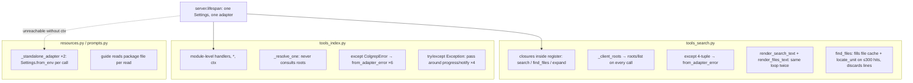
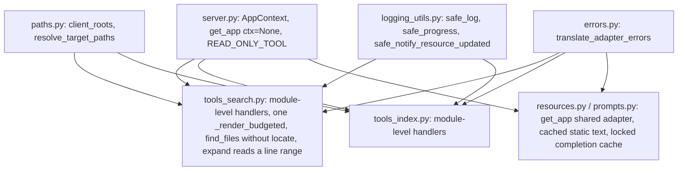
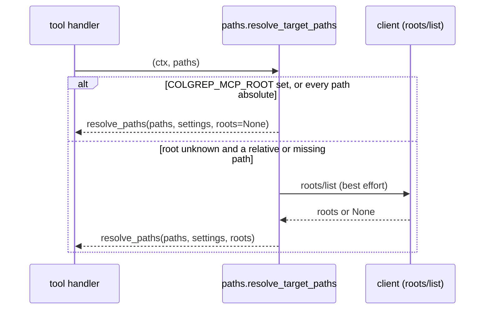

# consistency — Architecture Analysis (v0)

Date: 2026-09-12

## Executive Summary
- **Problem**: `server/colgrep_mcp/` was written by three implementers in parallel against one contract (R01/R05). The contract held, but the *idioms* diverged: two tool-definition styles, two adapter-error translations (one of which lets a `ColgrepError` escape as an uncoded error), two path-resolution paths (only `search` consults client roots), two budgeted renderers, two standalone adapters that re-parse the environment per call, four inline copies of the "best-effort notification" pattern, and docstrings that narrate roadmap steps and cite finding ids (`F11`, `R05 D1`) with no legend. Two handlers also do work the hardware never needed: `find_files` reads every hit file and re-locates up to 300 units only to throw the locations away, and `expand` reads a whole file to return at most 200 lines of it.
- **Proposed change**: one idiom per concern, each owned by exactly one module (§Contracts C1–C6), then every consumer switched to it; the two wasteful handlers made proportional to their output; docstrings reduced to *why* plus a legend for report ids. No client-visible behaviour changes.
- **Non-goals**: new tools, arguments or resources; changing `hit_id`, text layout, notes, codes or hints; touching the `mcp` SDK version; `ruff format` sweep (still deferred, still one commit later); PyPI publish.
- **Biggest risks**: a "no behaviour change" refactor that quietly changes a note or a text line (the suite is the oracle, and it is strict); four parallel branches touching `tests/` (ownership table below is disjoint by construction); the 3 h budget (each leaf is sized to ≤ 50 min and told to stop at a fixed clock time).
- **Validation approach**: `uv run pytest` must stay at 196 passing with zero test *semantics* changed — a test may be edited only where it reaches into a private helper whose name or signature this pass changes; `uv run ruff check` clean; each `perf` commit carries a measured before/after in its body per `CONTRIBUTING.md`; one read-only reviewer pass over the merged depth-0 result.

## Current State

## Proposed State

## Key Flow: path resolution after the change

The Claude Code plugin always sets `COLGREP_MCP_ROOT`, so under the plugin the round-trip disappears from every `search`/`find_files` call. Under a bare `claude mcp add` it happens only when it can change the answer.

## Contracts & Invariants

### C1 — One app handle (`server.py`)
- `lifespan` stores the `AppContext` it yields in a module global and clears it on exit.
- `get_app(ctx: Context | None = None) -> AppContext`: with a `ctx`, the request's lifespan context as today; without one, the module global; `RuntimeError("server not running")` if neither. `get_adapter`/`get_settings` accept the same optional `ctx`.
- `READ_ONLY_TOOL: ToolAnnotations` (read-only, idempotent, closed-world) is defined once here and used by every read-only tool registration.
- Invariant: exactly one `ColgrepAdapter` and one `Settings` exist per running server; `Settings.from_env()` is called once per process lifetime (plus `__main__`'s fail-fast parse).

### C2 — One path resolver (`paths.py`)
- `async client_roots(ctx) -> list[Path] | None` — moved verbatim from `tools_search._client_roots`.
- `async resolve_target_paths(ctx, paths: list[str] | None) -> list[Path]` — settings from `get_settings(ctx)`; calls `client_roots` **only** when `settings.root is None` and (`paths` is empty or any path is relative); then `resolve_paths(...)` as today.
- `resolve_paths`/`default_root` keep their signatures (tests import them).
- Invariant: every path-taking tool (`search`, `find_files`, `index_status`, `index_build`, `index_clear`) resolves through `resolve_target_paths`; `doctor` reports `default_root(settings, roots)` with the same lazily fetched roots so its answer matches what the tools will do.

### C3 — One error translation (`errors.py`)
- `translate_adapter_errors(path: Path | None = None)` — `@asynccontextmanager`; body raises `ColgrepError` → re-raised as `from_adapter_error(exc, path=path) from exc`. Catches the **base class**, so the argv/absolute-path guards in `adapter.py` (bare `ColgrepError`) become `[COLGREP_FAILED]` instead of an uncoded `UnexpectedToolError`.
- Invariant: no `try: … except Colgrep…: raise from_adapter_error` block remains outside `errors.py`; `resources._map_adapter_error` wraps the same string into `ResourceError` (unchanged wording).

### C4 — One best-effort notification idiom (`logging_utils.py`)
- `safe_log(ctx, level, message)` unchanged.
- `safe_progress(ctx, progress: float, total: float | None, message: str)` and `safe_notify_resource_updated(ctx, uri: str)` — same "never raise, debug-log the drop" contract.
- Invariant: no `except Exception: pass` around a client notification remains in a tool module.

### C5 — One tool-definition style
- Every tool is a module-level `async def name(<args>, *, ctx: Context) -> CallToolResult` with `Annotated[..., Field(...)]` parameters, registered in that module's `register(mcp)` via `mcp.tool(title=..., annotations=...)(name)`. This is `tools_index.py`'s existing style; `tools_search.py` converts to it. Tool names, titles, annotations, argument names, defaults, descriptions and docstrings (the client-visible tool descriptions) are byte-identical before and after — the JSON schema `Client.list_tools()` returns is part of the oracle.
- `_do_search` returns a `SearchResult` only (`hits` is `result.hits`) and takes `locate: bool` — `False` skips `_fill_file_cache` and `locate_unit`, building `hit_id` from colgrep's reported lines with `location_verified=False`. `find_files` passes `False`; it never exposes lines.
- `render_search_text`/`render_files_text` keep their signatures and outputs; both delegate to one `_render_budgeted(header, blocks, more_note, trailing_notes, budget) -> tuple[str, bool]`.
- `expand` reads `[line, end_line]` with `itertools.islice` over the open file in the worker thread; output identical, including `truncated`.

### C6 — Docstrings and navigability
- Module and function docstrings state what the object is for and *why* it is shaped that way. They do not narrate roadmap steps ("Step 1 provides…", "Implemented in leaf…") or which agent wrote them.
- Report ids stay allowed because they are the only pointer to measured evidence, but `AGENTS.md` gains a legend: `R01` = `__reports__/colgrep_mcp/00-architecture_v0.md`, `R05` = `02-architecture_v1.md` (D1–D11, M1–M5 are its sections), `F1–F14` = `02-observation_code_review_v0.md` findings, `R03` = `01-findings_colgrep_behaviour_v0.md`.

### Error model
Unchanged: `ToolError` messages `[CODE] <detail> Next: <hint>`, notes `[CODE] …`. The only observable delta is C3's: a `ColgrepError` raised by the adapter's own argument guards now surfaces coded (`[COLGREP_FAILED] …`) where it previously surfaced as the SDK's generic error. A test pins this.

## Alternatives Considered
| Decision | Options | Chosen | Why |
|:--|:--|:--|:--|
| Shared adapter for static resources | keep per-call `Settings.from_env()`; module-global app set by lifespan; register static resources as templates to get a `ctx` | module global | The SDK gives static resources no `ctx`; a global set/cleared by the lifespan is the smallest change and makes "one adapter per server" true instead of aspirational |
| Roots round-trip | always (today); never (rely on env/cwd); lazily when it can matter | lazily | Under the plugin the env root is always set, so the call is pure latency; a bare client with relative paths still gets the documented fallback |
| Tool style | closures (search) vs module-level (index) | module-level | Handlers become importable and greppable by name; the closure style hides three tools behind one `register` symbol |
| `find_files` locating | keep (uniform `hit_id`s); skip | skip | The tool never exposes `line`/`hit_id`; up to 300 file reads and 300 `locate_unit` passes per call are pure waste. `hit_id` on the discarded hits is built from reported lines, which nothing consumes |
| Shared helpers | each leaf adds what it needs; lead adds all helpers before dispatch | lead first | Four parallel branches must not each invent `safe_progress`; an additive commit on the campaign branch costs the lead ten minutes and removes every cross-leaf edit |
| Docstring cleanup | per leaf; one pass after merge | one pass after merge | Cross-cutting by nature; doing it inside four branches guarantees conflicts |

## Risks & Mitigations
| # | Risk | Mitigation |
|:--|:--|:--|
| 1 | A refactor changes a rendered line, note or schema | Tests are the oracle and may only be edited at private-helper call sites; a new `test_tool_schema_snapshot`-style check is **not** added this cycle (time) — the reviewer diffs `list_tools()` output before/after instead |
| 2 | Module-global app handle leaks between tests | `lifespan` clears it in `finally`; tests already run one `Client(build())` per test |
| 3 | `find_files` without locate changes `by_file` grouping | Grouping keys on `hit.file`, which `_resolve_hit_file` still normalises; scores and names are untouched |
| 4 | `itertools.islice` in `expand` vs `read_text` differ on encoding errors or final newline | Open with `errors="replace"`, strip only the trailing newline per line as `splitlines()` does; the existing expand tests cover the truncated and out-of-range cases |
| 5 | Four branches touch `tests/` | Ownership table below is disjoint; anything outside a leaf's files is reported, not edited |
| 6 | Time | Each leaf: ≤ 3 steps, stop-and-report clock time in the dispatch prompt; the lead merges whatever is green |

## Roadmap Recommendation
Tier 2 at `__roadmap__/consistency/`: depth 0 has four file-disjoint leaves, depth 1 (`integrate/`) has the cross-cutting docstring pass and the reviewer.

| Leaf | Owns (edits nothing else) |
|:--|:--|
| `search_tools` | `server/colgrep_mcp/tools_search.py`, `server/tests/test_tools_search.py`, `server/tests/test_render.py` |
| `index_tools` | `server/colgrep_mcp/tools_index.py`, `server/tests/test_tools_index.py` |
| `context_free_handlers` | `server/colgrep_mcp/resources.py`, `server/colgrep_mcp/prompts.py`, `server/tests/test_resources.py`, `server/tests/test_prompts.py` |
| `adapter_hygiene` | `server/colgrep_mcp/adapter.py`, `server/colgrep_mcp/locks.py`, `server/tests/test_adapter.py`, `server/tests/test_locks.py` |
| `integrate/docstrings` | every `server/colgrep_mcp/*.py` docstring, `AGENTS.md` legend |
| `integrate/review` | read-only; writes `__reports__/consistency/01-observation_review_v0.md` |

The lead owns `server.py`, `paths.py`, `errors.py`, `logging_utils.py` and their tests (`test_paths.py`, `test_errors.py`), commits C1–C4 before dispatch, and does the integration.
