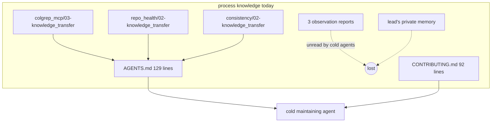
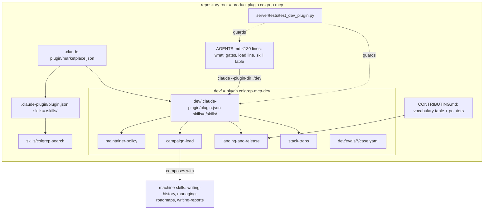
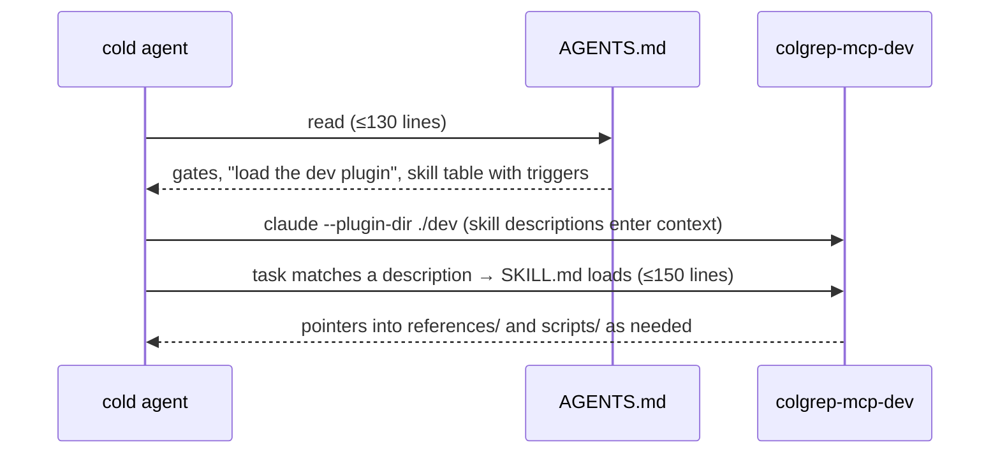

# dev_plugin — Architecture Analysis (v0)

Date: 2026-09-12

Report id in this campaign: **R01 (dev_plugin)**. Earlier campaigns' reports are cited by the ids in `AGENTS.md` §Report ids.

## Executive Summary
- **Problem**: three cycles of process knowledge (how this repository is led, landed, released, and what its stack does behind your back) live in reports a cold agent is not told to read, in `AGENTS.md`/`CONTRIBUTING.md` prose that is already at its line cap, and in one lead's private memory. The consumers of that knowledge are LLM agents inside harnesses; the form they load on demand is a *skill*.
- **Proposed change**: package the maintainer's dev environment as a second Claude Code plugin in this repository, `colgrep-mcp-dev` (`dev/`), shipping four skills authored to skill-creator's progressive-disclosure standard; shrink `AGENTS.md`/`CONTRIBUTING.md` to a surface that points at them; guard the arrangement with drift tests. Alongside, land the consistency retrospective's follow-ups that have a measurable gate: a `FileHit`-only path for `find_files`, a measured decision on per-stderr-line log notifications during `search`, a text budget for `list_indexes`. The `ruff format` sweep landed first (`bdc029d`), while no branch was open.
- **Non-goals**: no new tool or argument; no change to the product plugin's manifests, skills path or launch; no PyPI publish (needs credentials the lead cannot enter); no Codex verification (no Codex CLI on this machine).
- **Biggest risks**: skills that restate reports instead of distilling them (R1); the surface files drifting back into manuals (R2); an implementer changing client-visible `search` behaviour without a pinning test (R3); eval cases that are never run because `claude -p` is unusable on this machine (R4).
- **Validation**: the existing gates plus `tests/test_dev_plugin.py` (already on the branch, `1ceaa95`), `claude plugin validate` for `.`, `./dev` and the marketplace, a `Client.list_tools()` dump-and-diff for the code leaves, and a read-only reviewer pass.

## Current State


## Proposed State


## Key Flow: a cold agent arrives


## Contracts & Invariants

### C1 — Two plugins, disjoint by construction
- `dev/.claude-plugin/plugin.json`: `name: colgrep-mcp-dev`, `skills: ./skills/`, no `mcpServers`; version tracked by `cz bump` (see C5).
- `.claude-plugin/marketplace.json` lists exactly `colgrep-mcp` (`source: ./`) and `colgrep-mcp-dev` (`source: ./dev`).
- The product manifests (`plugin.json`, `.claude-plugin/plugin.json`, `.claude-plugin/mcp.json`, `.codex-plugin/plugin.json`, `.agents/`, `skills/colgrep-search`) are not edited by any leaf of this campaign.
- Pinned by `tests/test_dev_plugin.py::test_marketplace_lists_both_plugins_from_disjoint_sources` and `::test_product_plugin_never_ships_the_dev_skills`; `claude plugin validate .`, `claude plugin validate ./dev` both pass.

### C2 — Skill anatomy (skill-creator standard)
```
dev/skills/<name>/
├── SKILL.md            ≤ 150 lines. Front matter: name == directory; description ≥ 80 chars that
│                        says WHAT it does and precisely WHEN to load it (pushy, concrete triggers).
│                        Body: imperative, explains WHY, points at references/ and scripts/.
├── references/*.md     depth: tables, checklists, templates, probe lists. A file > 300 lines gets a
│                        table of contents at the top.
└── scripts/*           mechanical steps only (bash or python, executable, `--help` text, exit codes).
dev/evals/<name>-triggers/case.yaml   one triggering eval per skill (format below).
```
- A fact belongs in exactly one skill; another skill that needs it links `See <skill>/references/<file>.md` instead of restating.
- Every fact keeps its provenance as a report id (`R01`–`R05`, `F1`–`F14`, campaign KT reports) or a commit SHA when a report does not exist; skills cite, they do not narrate.
- Skills never contradict the machinery: when a skill and `[tool.commitizen]`/`CONTRIBUTING.md` disagree, the skill is wrong until the machinery is changed.
- Pinned by `test_dev_plugin.py::test_every_dev_skill_has_a_name_matching_its_directory_and_a_description`.

### C3 — Surface files
- `AGENTS.md` ≤ 130 lines (`AGENTS_LINE_CAP`), names every `dev/skills/*` in backticks, contains `--plugin-dir ./dev` and `colgrep-mcp-dev@colgrep-mcp`. Holds only: what the repo is, the repo map, the gate commands, the report-id legend (skills cite it), the load line, the skill table (skill → when it fires). Traps, conventions, campaign procedure move into skills.
- `CONTRIBUTING.md`: the commit-type table and the scope list (they mirror `[tool.commitizen]` and `cz check` enforces them) plus the release recipe one-liner, then pointers to `landing-and-release` for everything else. Under 60 lines.
- `CLAUDE.md` stays `@AGENTS.md`.
- Pinned by `test_dev_plugin.py::test_agents_md_*`.

### C4 — Content inventory: every fact the skills must carry
The four subsections below are the checklist each skill leaf works through; the reviewer probes for omissions against it. Sources: `KT-B` = `__reports__/colgrep_mcp/03-knowledge_transfer_v0.md`, `KT-H` = `__reports__/repo_health/02-knowledge_transfer_v0.md`, `KT-C` = `__reports__/consistency/02-knowledge_transfer_v0.md`, `OBS-B` = `__reports__/colgrep_mcp/02-observation_code_review_v0.md`, `OBS-H` = `__reports__/repo_health/01-observation_review_v0.md`, `OBS-C` = `__reports__/consistency/01-observation_review_v0.md`, `PH` = `__reports__/repo_health/00-findings_launch_placeholders_v0.md`, `RI` = `__reports__/repo_health/04-findings_remote_install_v0.md`, `CI` = `__reports__/repo_health/03-findings_ci_matrix_v0.md`, `MEM` = lead memory (no report; cite the fact as "lead memory, 2026-09-12").

#### `maintainer-policy` — "for agents, by agents" and hardware-first code
- Consumers are LLM agents inside harnesses, both end users (through the MCP tools) and maintainers; every design, engineering and project-management decision is judged by whether it makes an agent's next command shorter or a failure disappear. The human-facing landing `README.md` is the one exception (humans read it to decide whether to install or point their agents at it). `MEM`, `KT-H` §Executive Summary.
- Generic GitHub ceremony (heavy CI, hooks, badges, templates, bots) is suspect unless it removes an agent command or an agent failure. `MEM` (repo_health brief: "a lot of good code or github practice is overengineering").
- Enforcement is CI-only; no blocking git hooks (an agent authoring commits pays a retry loop for no local benefit). `CONTRIBUTING.md` §Checks, `KT-H`.
- Drift tests over process: when two artefacts must agree (versions, manifests, README tool table, changelog headings, AGENTS.md vs shipped skills), write a test that fails when they disagree instead of a checklist item. Existing guards: `test_version.py`, `test_manifests.py`, `test_changelog.py`, `test_readme.py`, `test_dev_plugin.py`. Before accepting any generator config, run its dry-run against the existing artefact and diff. `KT-H` §Next-cycle Changes.
- Docstrings say *why* and cite report ids from the `AGENTS.md` legend; no roadmap-step narration. `KT-C` §Executive Summary; `consistency/00-architecture_v0.md` §C6.
- Hardware-first (Casey Muratori school): code is for the hardware before it is for humans; "it's I/O-bound anyway" is not an argument, because per-call waste accumulates across every program sharing the machine. Hunt work proportional to the *input* rather than the *output*: file reads, syscalls, subprocess spawns, protocol round-trips (`roots/list`, per-line notifications), environment copies, `Path.resolve()` per lock, per-request file reads; remove it even when each instance is small; make I/O lazy where the answer may not matter. Human-readability arguments alone do not justify a change. `MEM`, `KT-C` (find_files 63.4→0.65 ms, expand 6.1→0.03 ms, env copies, per-lock resolve, per-request guide reads).
- One idiom per concern so agents navigate by symbol: `server.register_tool`, `paths.resolve_target_paths`, `errors.translate_adapter_errors`, `logging_utils.safe_*`, `server.get_app(ctx=None)`, one budgeted renderer. `AGENTS.md` §Conventions (moves here), `KT-C`.
- Perf convention: a `perf` commit's body carries a measured before/after — median of 5, synthetic corpora in the scratchpad, never the real `colgrep` against this repository, a reviewer reproduces within 2×; without numbers the type is `refactor`. `CONTRIBUTING.md`, `KT-C` §Wins, `OBS-C` probe 5.
- A regression test counts only once it has failed against the old code; say so in the `fix` commit body. `KT-C` §Root Causes.
- Client-visible behaviour of product tools does not change unless a leaf says so and a test pins it. `consistency` roadmap README §Gotchas.

#### `campaign-lead` — dispatch and project management (composes with the machine skills)
- Order of operations: architecture report first (contracts, file ownership per leaf, risks) under `__reports__/<topic>/` via `writing-reports`; roadmap via `managing-roadmaps` (`dirtree-rdm init/add`); commit specs and shared helpers *before* dispatch; one worktree per leaf created by hand; dispatch; merge level by level; reviewer after any level with more than two parallel branches; knowledge-transfer report to close. `KT-B` §Wins, `KT-C` §Wins (helpers before dispatch → zero conflicts).
- `dirtree-rdm` grammar gotchas: `## Reference Documents` bullets must start `[R<nn> …]`; nothing may follow `(expected: PASS)` in a consistency check; step headings `## Step 1..5`; run `bash ~/.claude/skills/managing-roadmaps/scripts/dirtree-rdm.sh grammar leaf` before writing leaf files; status tables are written only by the tool. `KT-C` §Pain Points.
- Worktrees: `git worktree add <path> -b task/<leaf> <campaign-branch>` by the lead; the Agent tool's `isolation: worktree` branches from the primary checkout's `main`, not the campaign branch (one wasted dispatch round in repo_health). Worktrees see only committed files: commit specs first. `KT-H` §Pain Points, `KT-B` §Root Causes, `MEM`.
- "Stop if the leaf file is missing from your worktree" in every dispatch prompt; it made the wrong-base failure cost ~15 s and zero stray commits. `KT-H` §Wins.
- File-disjoint ownership declared in the roadmap README §Gotchas: a leaf edits only its files and *reports* anything else in its final message; both repo_health and consistency had zero conflicts this way. `KT-H`, `KT-C` §Wins.
- Hard stop time per leaf, stated in the leaf and the prompt; the lead merges what is green at the stop. `consistency` roadmap README §Gotchas.
- The lead does lead-sized leaves itself (adapter hygiene took 4 min; scaffold, shared helpers, CI, AGENTS.md, changelog fix); delegation costs prompt tokens and latency. `KT-C`, `KT-H` §Wins.
- Agent-reported test counts are not evidence; re-run the gates on every branch (one agent reported 196 on a branch with 206). `KT-C` §Pain Points.
- Reviewer pass: read-only Sonnet agent after a level with >2 parallel branches; give it the architecture contract, the list of *intentional* deltas (so it re-reports nothing and proves they are the only deltas), and tell it to probe every validator with deliberately invalid inputs (`cz check --message`, drift tests with a broken fixture) — both commitizen defects were found that way, never by valid history. Findings land as an observation report the lead routes to fixes or the retrospective. `KT-H` §Review process changes, `KT-C` §Wins, `OBS-H`.
- Refactor leaves name an explicit dump-and-diff oracle: `Client.list_tools()`/`list_resources()`/`list_resource_templates()`/`list_prompts()` JSON dumped on the base and the branch, diff empty; the SDK ships `__doc__` verbatim, so whitespace is client-visible. `KT-C` §Wins, `OBS-C` probe 1.
- Windows CI is the only portability oracle; read its verdict (not skim) whenever a leaf adds the first test of a previously untested path, and name that path in the PR body (`url2pathname` fix in PR #3; `.cmd` wrapper for the fake binary in PR #1). `KT-C` §Pain Points, `CI`.
- Subagents that "watch CI in the background" end their turn instead; make them block on `gh run watch --exit-status` or read the run yourself. `MEM`.
- Dispatch-prompt template (worktree path, branch, leaf file, ownership, gates, commit rules, hard stop, final-report shape): the prompt this leaf's implementer received *is* the template; it is reproduced with placeholders in `references/dispatch-prompt.md`.
- Time-boxing: note the clock at the start, 3 h box, previous cycles closed in 50 min–4 h; the Progress table records per-leaf minutes. `KT-C`, `KT-H`.

#### `landing-and-release` — git and release mechanics
- Commits: `type(scope): description`, mandatory kebab-case scope, subject ≤ 100 chars (whole line), lowercase after the colon, no trailing period, imperative; body says WHY; one roadmap step = one commit, the step's `**Commit**` field is the subject. Types/bumps table: `CONTRIBUTING.md` (stays there; the skill links it). Probe the validator: `cd server && uv run cz check --message "<subject>"` with deliberately invalid subjects (missing scope, trailing period, capitalised type, unknown type). `OBS-H` Check 1.
- Integration: rebase the task branch onto its target, re-run gates, merge with `git merge --no-ff -m "<message naming the unit of work>"`; `git merge -F -` does not read stdin inside an `&&` chain. After any conflicting merge search the tree for `<<<<<<<` before committing (bit the repo twice). `KT-C`, `KT-B` §Pain Points; `writing-history` for the general method.
- Never bare `git stash`: the stash is shared across worktrees and sessions; prefer a WIP commit, else `git stash push -u -m <tag>` and `apply` by SHA. Environment rule, `MEM`.
- `.gitignore` rules are written for the repo, not the package: anchor them (`/server/build/`), a bare `build/` hid `__roadmap__/**/build/`. `KT-B` §Pain Points.
- Branches: `main` always installable; `task/<leaf>` per roadmap leaf from the campaign branch; a campaign branch may be the session's `claude/<name>` branch; delete merged branches and remove worktrees only after merge (`git worktree remove`, `git branch -d`). `CONTRIBUTING.md` §Branching.
- Landing a PR: `gh pr create` from the campaign branch; CI (`ruff`, `ruff format --check`, `pytest` on three OSes, `cz check` on the PR range) must be green; land with `gh pr merge --merge --subject "<conventional subject> (PR #N)"` so the PR shows as merged. A local rebase-then-`--no-ff` merge pushed to `main` rewrites the SHAs and GitHub leaves the PR *open*: close it by hand with a pointer to the merge commit (PR #1, #2). `MEM`.
- Release, from the main checkout only (`~/colgrep-mcp`), never a scratch or detached worktree: `cd server && uv run cz bump --changelog && uv run pytest && git push origin main v<x.y.z>`. The tag is lightweight so `--follow-tags` skips it: name the tag. The permission classifier blocked `git push … HEAD:main` and `cz bump` from a detached `/private/tmp` worktree in the consistency session but allowed them from the main checkout. `CONTRIBUTING.md`, `MEM`.
- `cz bump` rewrites `pyproject.toml`, `uv.lock` (pre-bump hook), the four manifests (`version_files`) and `CHANGELOG.md`, commits `release(colgrep-mcp): v<x.y.z>`; never author a release commit or edit a version by hand; `uv run` re-syncs the editable install, so a version-drift test failure means a hand edit. `AGENTS.md` §Traps (moves here), `OBS-H` Check 4.
- Commitizen gotchas: the incremental changelog cannot parse hand-written Keep-a-Changelog headings (`## [0.1.0] - date`) and would duplicate them — `test_changelog.py` pins the parseable shape; `cz bump --dry-run` does not list touched files (use `git status --porcelain` after a throwaway bump instead); `feat(x)!:` is accepted by `cz check` but the bump map cannot see the `!` (only the `BREAKING CHANGE:` footer bumps major); `schema_pattern` needs its end anchor to reject a trailing period; `cz check --rev-range` only ever sees valid history, so probe with `--message`. `KT-H` §Pain Points, `OBS-H` findings 1–3.
- Scripts (mechanical, in `scripts/`): `land_branch.sh <task-branch> <target>` (rebase, gates, `--no-ff -m`, conflict-marker search, exit non-zero on any red); `probe_cz_check.sh` (the invalid-subject probe table with expected exit codes); `release.sh` (refuses to run outside the main checkout or off `main`, runs the recipe, prints the tag to push). Each prints what it will do and stops on the first red gate.

#### `stack-traps` — colgrep, MCP SDK v2, Claude Code plugin specifics
- `colgrep --color never <subcommand>` is a *search* for the words `<subcommand>`: clap parses global flags before a bare word as a query and indexes the cwd. Put global flags after the subcommand (`colgrep status --color never`). One agent indexed its worktree this way. `KT-B` §Pain Points, `adapter.py` docstring.
- colgrep folds a path into the nearest already-indexed ancestor project and `clear` is project-wide: never run the e2e driver (`server/tests/e2e/run_e2e.py`) or `colgrep init` against this repository or its worktrees; the driver refuses this repo on purpose; the e2e corpus lives at `~/colgrep-e2e-corpus/click`. `KT-B`, `R03`, `AGENTS.md` §Traps (moves here), `MEM`.
- colgrep 1.6.2 reports wrong `line`/`end_line` for most units while `code` is exact; the server re-locates (`locate.py`) and flags `location_verified`; `--no-pool` re-probe still open. `R03`, `KT-B` §Open Questions.
- The SDK ships `__doc__` verbatim as the tool description, indentation included; hence `server.register_tool` dedents, and `test_smoke.py::test_tool_descriptions_are_dedented` pins it. `KT-C` §Pain Points.
- `pydantic.validate_call` (the SDK wraps every resource handler in it) rejects a `functools.cache`/`lru_cache` wrapper; put the cache one level down. `KT-C` §Pain Points.
- Static resources and the completion callback receive no request `Context`; the lifespan's app handle is reached through `server.get_app(ctx=None)` on a `ContextVar` (a module global corrupted overlapping sessions, `OBS-C` OV1). `KT-C`.
- Protocol 2026-07-28 deprecates roots, sampling, logging and the handshake: `roots/list` and elicitation only work on legacy-mode sessions (`Client(..., mode="legacy")` in tests); every `ctx.info` triggers a deprecation warning filtered at startup; notifications go through `logging_utils.safe_*` so a client refusal never fails a tool. `KT-B` §Root Causes, `R02` feature matrix.
- Client roots arrive as `file:///C:/Users/…` on Windows: convert with `urllib.request.url2pathname`, never `Path(uri.path)`. `KT-C` §Pain Points, PR #3.
- `claude -p` is unusable on an expired OAuth session (`Failed to authenticate: OAuth session expired`); the plugin gate degrades to `claude --plugin-dir . mcp list` (server shows `✔ Connected`); skill-creator's `run_loop.py`/`run_eval.py` and `claude plugin eval` also need it. `KT-B`, this campaign.
- A root `.mcp.json` is read by Claude Code as *project* MCP config where `${CLAUDE_PLUGIN_ROOT}` is never expanded (spawn ENOENT); the plugin's MCP config lives in `.claude-plugin/mcp.json`; placeholders go in `args`/`env`, never `command`; `${VAR:-default}` is documented for project scope only; Agent Plugins 1.0 forbids any fallback syntax; Codex's expansion of `${CLAUDE_PLUGIN_ROOT}` is still unverified (no Codex CLI here). `PH`.
- Marketplace and plugin names live in separate namespaces: `colgrep-mcp@colgrep-mcp` is valid; the Codex marketplace is `colgrep-mcp-marketplace`; `source: "./"` and `./dev` resolve relative to the marketplace root for git installs. `RI`.
- Windows CI: the fake binary must be launched through a `.cmd` wrapper; `setup-uv` has no moving `v10` tag (pin `v10.1.0`); `uv run` re-syncs the editable install before running. `CI`, `KT-H`.
- The shell-search hook on this machine blocks corpus searches (`grep -r`, `rg`) and any Bash command whose text mentions them, heredocs included; write such files with the Write tool or word the text differently; `COLGREP_BYPASS=1` for a command that must run. `KT-H` §Pain Points.
- The two worktree traps for reviewers: `git worktree add --detach <dir> $(git rev-parse main)` because `main` is checked out elsewhere; remove the worktree afterwards. `OBS-C` §Scope Boundary.

### C5 — Versioning decision (recorded)
The dev plugin's version joins `cz bump`'s `version_files` (done in `1ceaa95`, pinned by `test_manifests.py::test_versions_aligned` and `test_dev_plugin.py`). Rationale: its skills describe how to maintain *this* repository at *this* version; a single bump moving every manifest is one line of config, and an unversioned plugin cannot be told apart across installs. Rejected: an independent version stream (a second `cz` project for prose), and no version (Claude Code shows `unknown`).

### C6 — `search` path
- **`FileHit`-only `find_files`**: `_do_search(..., locate=False)` still builds a `SearchHit` and a `hit_id` per raw hit that `find_files` discards. Contract: a `_collect(raw_hits)` step parameterised by what the caller needs — `find_files` folds raw hits straight into `FileHit`s (file, best score, count, top 5 unit names) without `SearchHit`/`hit_id`/`_resolve_hit_file` per hit beyond the one `str` normalisation the file key needs; `search` unchanged. Oracle: `structured_content["files"]` of `find_files` on the fake corpus byte-identical before/after; `Client.list_tools()` JSON identical; `perf(search)` body with median-of-5 before/after on a synthetic 300-hit result; `test_find_files_does_not_read_hit_files` stays green and a new test asserts `hit_from_raw` is never called on the `find_files` path (monkeypatch counter). The double `resolve()` of `unit.file` on the `search` path (KT-C §Open Questions) is folded if the same function is touched, else left.
- **Stderr notifications**: `_do_search.on_stderr` sends one `notifications/message` per colgrep stderr line while the logging capability is deprecated upstream. Decision rule: measure, on the fake colgrep emitting N stderr lines (the fake's index-update chatter), the count of `notifications/message` frames per `search` call and their total bytes, before and after. **Decision**: keep zero per-line notifications; the result already carries `index_updated` (R05 D7) and notes; after the call, send at most one summary notification only when `index_updated` is true (one round-trip instead of N). This is a client-visible delta and must be listed as intentional in the reviewer prompt; a test pins "at most one log notification per `search`" via a legacy-mode client capturing `logging` callbacks, and `stderr_lines` is still collected for `index_updated`. Findings report `01-findings_stderr_notifications_v0.md` records the numbers and the rule. Commit type `perf(search)` with the numbers, or `refactor(search)` if the measured saving is zero frames.

### C7 — `list_indexes` budget
`_render_index_list` renders every indexed project on the machine (24 kB on one machine, `KT-B`); the text is machine-global. Contract: render through `tools_search._render_budgeted` (the one budgeted renderer, R01 consistency) with header `"<n> indexed projects"`, one block per index, `more_note = "[k more indexes in structured_content]"`, budget `settings.text_budget`; when capped, `IndexList` gains no field — `structured_content` stays complete and the text says so. Test: a fake `stats()` returning 400 indexes renders ≤ `text_budget` chars and the structured content keeps all 400; `list_tools()` JSON unchanged. Type `feat(index)`? No: the tool's schema and arguments do not change and the cap is the same invariant every other renderer already honours → `fix(index)` (behaviour contradicts the R01 token-budget invariant).

### C8 — Oracles and allowed deltas
| Leaf | Dump-and-diff oracle | Intentional client-visible delta |
|:--|:--|:--|
| `search_path` | `list_tools()` JSON; `find_files` `files` JSON on the fixture | at most one log notification per `search` (was one per stderr line) |
| `list_indexes_budget` | `list_tools()` JSON | `list_indexes` text capped at `text_budget` with a continuation note |
| skills, surface | `claude plugin validate .`, `./dev`, marketplace; `test_dev_plugin.py` | none (product tools untouched) |

## Eval case format (`claude plugin eval`)
One case per skill at `dev/evals/<skill>-triggers/case.yaml`; the plugin's default eval dir is `evals/` under the plugin root, so no `experimental.evals` entry is needed. Cases are authored, not run, this cycle (`claude -p` is unusable here; see stack-traps); `--ablation with-without` treats the `tool_used: Skill` grader as the trigger indicator.
```yaml
schema_version: "1.1"
name: <skill>-triggers
description: The skill loads on a realistic maintainer prompt that never names it.
tags: [trigger]
runs: 3
execution:
  max_turns: 6
  timeout_seconds: 300
  allowed_tools: [Read, Glob, Skill]
prompt: |
  <a concrete, realistic prompt a maintaining agent would receive; no skill name in it>
graders:
  - name: skill-fired
    type: tool_used
    tool: Skill
    input_match: '"skill"\s*:\s*"(?:[\w-]+:)?<skill>"'
```
Source: https://code.claude.com/docs/en/plugin-evals.md (case fields, grader types, skill-trigger example).

## Alternatives Considered
- **Grow `AGENTS.md` / add `docs/`**: rejected; prose is read only when pointed at, already at its cap, and no ecosystem installs it.
- **Skills inside the product plugin**: rejected; end users would pay the description tokens of four maintainer skills on every session.
- **Separate repository for the dev plugin**: rejected; the knowledge is about this repository at this version (C5) and would drift.
- **Independent dev-plugin version or no version**: see C5.
- **Drop stderr forwarding entirely vs one summary**: one summary keeps the one fact an agent acts on (the index was rebuilt, so timings are cold) at the cost of one frame; per-line forwarding was N frames of colgrep chatter nobody parses.

## Risks & Mitigations
| # | Risk | Mitigation |
|:--|:--|:--|
| R1 | Skills restate reports at length instead of distilling | C2 line caps; each fact once with a citation; reviewer checks C4 coverage and SKILL.md length |
| R2 | Surface files drift back into manuals | `test_dev_plugin.py` line cap and skill-name check; C3 |
| R3 | `search_path` changes client-visible behaviour beyond the listed delta | C8 oracles; reviewer given the intentional-delta list; legacy-mode client test pins notification count |
| R4 | Eval cases never run | authored to the documented schema; `stack-traps` records why; first authenticated session runs `claude plugin eval ./dev --trust-plugin` |
| R5 | Four skill leaves plus two code leaves in parallel collide on shared files | ownership table below; `__reports__/dev_plugin/README.md` is touched only by `search_path` at depth 0 |
| R6 | 3 h box | hard stops: implementers 19:35 CEST, reviewer 20:05; the lead merges what is green |

## Roadmap Recommendation
Campaign `__roadmap__/dev_plugin/`, branch `claude/reverent-fermi-070f30` (this session's worktree). File ownership (disjoint):

| Leaf | Owns | Implementer |
|:--|:--|:--|
| `skill_policy` | `dev/skills/maintainer-policy/**`, `dev/evals/maintainer-policy-triggers/**` | Sonnet |
| `skill_campaign_lead` | `dev/skills/campaign-lead/**`, `dev/evals/campaign-lead-triggers/**` | Sonnet |
| `skill_landing_release` | `dev/skills/landing-and-release/**`, `dev/evals/landing-and-release-triggers/**` | Sonnet |
| `skill_stack_traps` | `dev/skills/stack-traps/**`, `dev/evals/stack-traps-triggers/**` | Sonnet |
| `search_path` | `server/colgrep_mcp/tools_search.py`, `server/tests/test_tools_search.py`, `__reports__/dev_plugin/01-findings_stderr_notifications_v0.md`, `__reports__/dev_plugin/README.md` (Round 01 entry) | Sonnet |
| `list_indexes_budget` | `server/colgrep_mcp/tools_index.py`, `server/tests/test_tools_index.py` | Sonnet |
| `integrate/review` | `__reports__/dev_plugin/02-observation_review_v0.md`, README entry | Sonnet, read-only |
| `integrate/surface` | `AGENTS.md`, `CONTRIBUTING.md`, `CLAUDE.md`, `dev/README.md` | lead |
| `integrate/close/knowledge_transfer` | `__reports__/dev_plugin/03-knowledge_transfer_v0.md`, README, release | lead |
