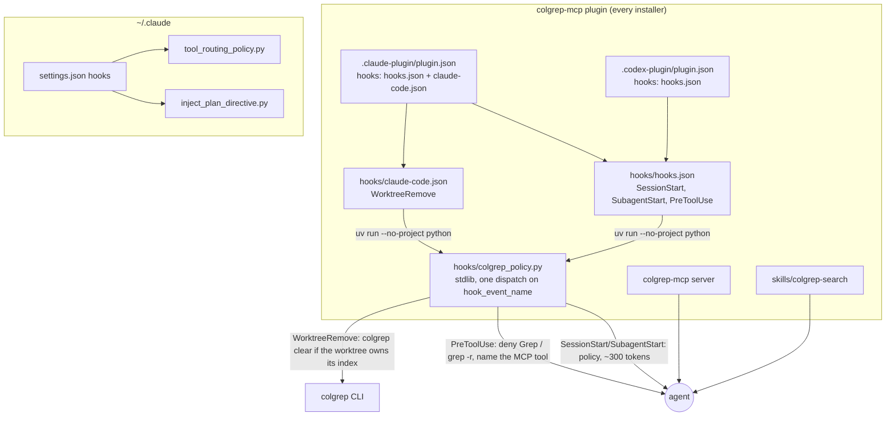
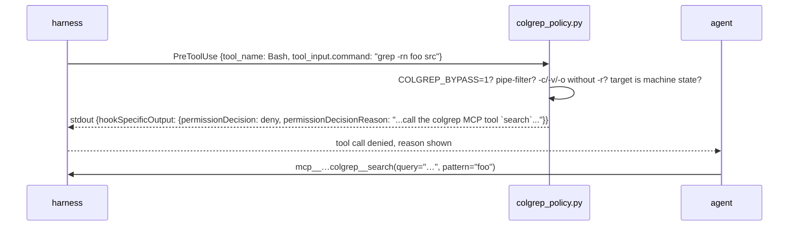
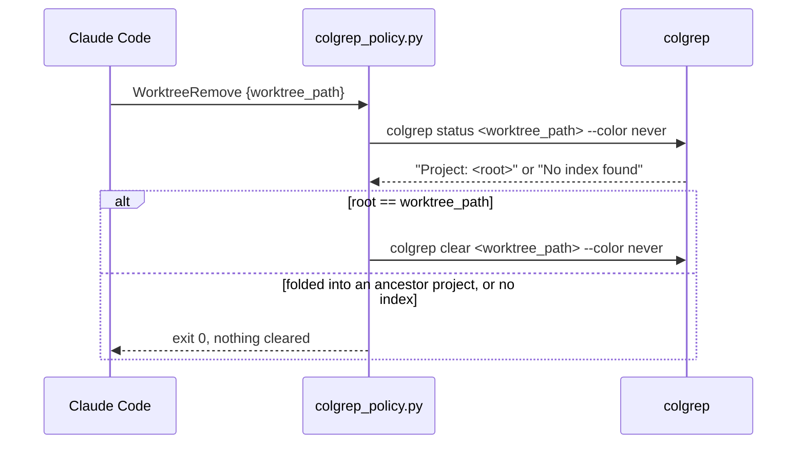

# Harness wiring for colgrep-mcp — Architecture Analysis (v0)

Date: 2026-09-13. Report id `R01` (harness_wiring) in the `AGENTS.md` legend.

## Executive Summary

- **Problem.** The maintainer's Claude Code harness enforces "search with
  colgrep" through four user-level hooks written for the *CLI*: a
  `SessionStart`/`SubagentStart` hook that injects the whole `colgrep --help`
  (6 979 characters, roughly 1 700 tokens, on every session and every
  subagent), a `PreToolUse` hook that blocks the `Grep` tool and recursive
  shell greps and points at CLI flags, and a `WorktreeRemove` hook that
  reaps a worktree's index with a machine-specific base path hard-coded.
  Now that the `colgrep-mcp` plugin puts `search`/`expand`/... in the tool
  list, those hooks teach the wrong interface, duplicate what the server's
  `instructions`, tool descriptions and skill already say, and live only on
  one machine, so no other installer of the plugin gets the enforcement.
- **Proposed change.** Move the wiring into the plugin, MCP-first: a
  `hooks/` component shipped by the product plugin with one stdlib Python
  script that (a) states a short search policy at session and subagent
  start, (b) denies `Grep` and recursive shell corpus searches with a
  message naming the MCP tools, and (c) reaps a removed worktree's own
  index. The harness-level hooks are retired; the plugin supplies them for
  every installer.
- **Cross-compatibility.** Claude Code, Codex and Cursor all consume the same
  `hooks.json` shape and the same stdin/stdout JSON contract; Codex reads a
  plugin's `hooks/hooks.json` by default and sets `CLAUDE_PLUGIN_ROOT` for
  compatibility; Cursor imports Claude Code hooks from `settings.json`
  files but not from plugins; Agent Plugins 1.0 leaves hooks out of scope
  and ignores extra directories. Portable events go in `hooks/hooks.json`;
  the one Claude-only event (`WorktreeRemove`) goes in a second file that
  only the Claude Code manifest names, so a Codex parser never sees it.
- **Non-goals.** No change to any MCP tool, resource or prompt (client-visible
  server behaviour is a leaf-level decision, `maintainer-policy`). No hook
  that nags on `Glob` (file-name lookup is not semantic search). No attempt
  to make Agent Plugins 1.0 clients run hooks.
- **Biggest risks.** A hook that costs 0.7 s per Bash call (measured for a
  `uvx` launcher) would be paid on every shell command; the launcher must
  stay at bare-interpreter cost. A Codex `hooks.json` parser that rejects an
  unknown event name would drop the whole file. A `python3` that does not
  resolve on Windows would fail open silently.
- **Validation.** Hook behaviour tested by driving the script as a
  subprocess from pytest (same pattern as `fake_colgrep.py`, so Windows CI
  covers it); drift tests pin the manifests to the hook files and the
  portable file to the portable event set; `claude plugin validate .` and a
  live `claude --plugin-dir . mcp list` plus a blocked `grep -r` in a session
  loading the tree.

## Current State

```mermaid
graph TD
    subgraph machine["~/.claude (this machine only)"]
        S[settings.json hooks] --> H1[colgrep_session_context.py<br/>SessionStart + SubagentStart<br/>injects colgrep --help, ~1.7k tokens]
        S --> H2[colgrep_redirect.py<br/>PreToolUse Grep|Bash<br/>exit 2: 'use colgrep -e ... -k']
        S --> H3[reap_worktree_index.py<br/>WorktreeRemove<br/>colgrep clear under a hard-coded base]
        S --> H4[tool_routing_policy.py<br/>domain-free, unchanged]
    end
    subgraph plugin["colgrep-mcp plugin (every installer)"]
        M[.claude-plugin/mcp.json] --> SRV[colgrep-mcp server<br/>instructions + 8 tools + guide]
        SK[skills/colgrep-search]
    end
    H1 -. teaches CLI flags .-> A((agent))
    H2 -. redirects to CLI .-> A
    SRV --> A
    SK --> A
```

Two voices reach the agent: the plugin says "call `search`", the harness
says "run `colgrep -e ... -k 25`". Subagents get both; installers on other
machines get neither hook.

## Proposed State



The CLI keeps exactly one role: the substrate a *hook* calls (hooks can
only run shell commands, never MCP tools). Every agent-facing sentence
names MCP tools.

## Key Flows





## Contracts & Invariants

### C1 — `hooks/hooks.json` is the portable file

Shape shared verbatim by Claude Code, Codex and Cursor's Claude-Code import:

```json
{"hooks": {"<Event>": [{"matcher": "<regex>", "hooks": [{"type": "command", "command": "...", "timeout": N}]}]}}
```

Events used: `SessionStart` (all sources — the policy is as needed after
`/clear` or a compaction as at startup), `SubagentStart` (no matcher: every
subagent), `PreToolUse` with matcher `Grep|Bash`. Every one of these is in
the intersection of the three ecosystems' event tables (Claude Code hooks
reference; Codex "Hooks" doc §Hooks; Cursor third-party hooks §Supported
Features). Invariant, pinned by a test: the events named in this file stay
inside that intersection.

Tool-name portability: Codex matches its shell as `Bash` and MCP tools as
`mcp__<server>__<tool>`; Cursor maps `Bash`→`Shell` and `Grep`→`Grep`; both
deliver the shell command in `tool_input.command`. Codex has no `Grep`
tool, so the `Grep` half of the matcher is inert there — harmless.

### C2 — `hooks/claude-code.json` holds Claude-only events

`WorktreeRemove` exists only in Claude Code. It lives in its own file named
only from `.claude-plugin/plugin.json` (`hooks` as an array of both files),
so Codex — which reads `hooks/hooks.json` by default or whatever
`.codex-plugin/plugin.json` `hooks` names — never parses an event name it
does not know. Invariant: no event in this file appears in the portable
file, and the Codex manifest never names this file.

### C3 — one launcher, plugin-root placeholder only in `args`-like position

Command: `uv run --no-project --quiet python "${CLAUDE_PLUGIN_ROOT}/hooks/colgrep_policy.py"`.

- `uv` is already a hard requirement (`uvx` launches the server), so the
  hook adds no dependency, and `uv` supplies an interpreter on Windows where
  `python3` may not resolve. Measured on this machine (median of 4–5 warm
  runs): `uv run --no-project python -c pass` 0.09 s; `python3 -c pass`
  0.10 s; `uvx colgrep-mcp==0.3.1 --version` 0.68 s. The last rules out
  shipping the hook inside the package behind the `uvx` launcher: a
  `PreToolUse` hook runs on every Bash call.
- `--no-project` keeps `uv` from syncing whatever project the session's cwd
  happens to be in; `--quiet` keeps its own output off the JSON channel.
- `${CLAUDE_PLUGIN_ROOT}` is expanded by Claude Code in hook commands and
  by Codex (which sets `CLAUDE_PLUGIN_ROOT` alongside `PLUGIN_ROOT` for
  plugin hooks, "Hooks" doc §Plugin-bundled hooks). It is the only
  placeholder in the hook surface and the placeholder is the same string in
  both ecosystems — unlike the MCP manifests, no per-ecosystem copy is
  needed.
- The script is stdlib-only and runs on Python ≥ 3.8 (the system `python3`
  on this Mac is 3.9.6; `uv` may pick it).

### C4 — the script's I/O contract

Input: one JSON object on stdin; fields read: `hook_event_name`,
`tool_name`, `tool_input.command`, `tool_input.path`, `cwd`,
`worktree_path`. Output, by event:

| Event | Decision | stdout | exit |
|:--|:--|:--|:--|
| `SessionStart`, `SubagentStart` | always | `{"hookSpecificOutput": {"hookEventName": <echoed>, "additionalContext": POLICY}}` | 0 |
| `PreToolUse` `Grep` | target is a source corpus | `{"hookSpecificOutput": {"hookEventName": "PreToolUse", "permissionDecision": "deny", "permissionDecisionReason": …}}` | 0 |
| `PreToolUse` `Bash` | command is a corpus search **and** every target is a source corpus **and** no `COLGREP_BYPASS=1` | same deny shape | 0 |
| `PreToolUse` otherwise | — | nothing | 0 |
| `WorktreeRemove` | `colgrep status <path>` reports `Project: <path>` itself | runs `colgrep clear <path> --color never` | 0 |
| any unknown event, unparsable stdin, missing binary | — | nothing | 0 |

The deny is the JSON `permissionDecision` form, not exit 2: Claude Code,
Codex and Cursor all honour it, and Cursor's import documents the mapping
(`permissionDecision`→`permission`, `permissionDecisionReason`→`user_message`).
Exit code 2 is *also* understood by all three, but the JSON form carries
the reason to the model on every harness, whereas exit-2 stderr reaches the
model only on Claude Code and Codex. Invariant: the script never exits
non-zero — every failure of its own is fail-open (a hook that crashes must
never make a session unusable).

`POLICY` stays under 2 000 characters: Codex truncates `additionalContext`
at roughly 2 500 tokens per handler and "context from multiple hooks and
plugins adds up"; the server's `instructions`, tool descriptions and
`colgrep://guide` already carry the how — the hook carries only the *rule*
and the *tool names*. Pinned by a test.

### C5 — the corpus-search detector is carried over, not redesigned

The regex set and the source-corpus gate from the machine hook
(`colgrep_redirect.py`) move verbatim: `xargs grep`, `find -exec grep`,
`rg` (except `rg --files`/`-l` enumeration), `grep -r` and friends; allowed
through: grep after a pipe, `-c`/`-v`/`-o` without `-r`, single-file grep,
targets under hidden directories or `~/Library` that are not a git work
tree. The one machine-specific list (`COLGREP_BLIND`, colgrep's ignored
`.claude/worktrees`) is dropped: on the MCP path a search inside an
ignored directory returns a coded empty result the agent can act on, and
`COLGREP_BYPASS=1` remains the sanctioned escape. `is_source_corpus` calls
`git rev-parse` only when a command already matched a search pattern, so
the per-Bash-call cost on the common path is one JSON parse and a handful
of regex tests.

### C6 — the harness keeps only domain-free hooks

`~/.claude/settings.json` drops the three colgrep entries; the retired
scripts move to `~/.claude/hooks/_retired-2026-09-13/` (reversible).
`tool_routing_policy.py` and `inject_plan_directive.py` stay. Until the
plugin release carrying `hooks/` is installed, that machine has no grep
enforcement; `claude --plugin-dir <this tree>` bridges the gap.

### Error model

- Hook script: every exception path exits 0 with no output. The only
  observable failure is "the block did not happen", which the agent cannot
  distinguish from "allowed" — accepted, because the alternative (a
  crashing hook) blocks the session.
- `WorktreeRemove`: `colgrep clear` on a path that is its own project root
  is project-local by construction; a folded path is never cleared
  (`PROJECT_ROOT_MISMATCH` logic mirrored from `index_clear`, R05 D3).

## Alternatives Considered

| Decision | Options | Chosen | Why |
|:--|:--|:--|:--|
| D1 Where the hooks live | (a) user `settings.json` on each machine; (b) the plugin's `hooks/`; (c) both | (b) | Every installer gets the enforcement; the harness stops teaching the CLI. (c) would duplicate messages. |
| D2 Launcher | (a) `uvx colgrep-mcp==<v> hook` (package subcommand, pinned by `cz bump`); (b) `python3 <script>`; (c) `uv run --no-project python <script>` | (c) | (a) measured 0.68 s per call — on every Bash call. (b) `python3` is not a given on Windows. (c) is 0.09 s and rides the `uv` requirement the plugin already has. |
| D3 Deny form | (a) exit 2 + stderr; (b) JSON `permissionDecision: deny` | (b) | Reason reaches the model on all three harnesses; Cursor documents the field mapping. |
| D4 Session context | (a) inject `colgrep --help` (status quo); (b) inject nothing, rely on MCP `instructions`; (c) a short policy naming the block and the tool names | (c) | (a) teaches the CLI and costs ~1.7k tokens per session and per subagent. (b) loses the one thing MCP cannot say: "the harness will deny `grep -r`, here is the bypass". |
| D5 `Glob` | (a) block or nag (upstream `colgrep` plugin nags); (b) leave alone | (b) | File-name lookup is not semantic search; colgrep has no equivalent (`-l` still needs a query). Carried from the machine hook. |
| D6 Claude-only events | (a) put `WorktreeRemove` in `hooks.json`; (b) separate file named only by the Claude Code manifest | (b) | A Codex parser rejecting an unknown event would drop every hook; unverified either way, so isolate. |
| D7 Agent Plugins 1.0 | (a) add a `hooks` field to `plugin.json`; (b) nothing | (b) | The spec defines skills and MCP servers only and says other component types "do not affect conformance"; `test_agent_plugin_fields_whitelist` forbids the field. A `hooks/` directory at the root is ignored by conforming clients. |
| D8 Cursor | (a) ship a `.cursor/hooks.json`; (b) document that Cursor imports Claude Code hooks only from `settings.json` files | (b) | Cursor does not load Claude Code *plugin* hooks; a project that wants them there copies the three entries into `.claude/settings.json`. Documented, not built: no Cursor here to verify. |
| D9 Roadmap tree | (a) `dirtree-rdm` roadmap; (b) architecture report + single-agent step commits | (b) | Every leaf here is lead-sized (`campaign-lead` §Rules); the `pypi_publication` cycle set the precedent. |

## Risks & Mitigations

| # | Risk | Likelihood | Mitigation |
|:--|:--|:--|:--|
| 1 | Codex rejects `hooks.json` on an unknown key or a Claude-only event | medium | C2 isolation; portable-event drift test; no Codex here — recorded as unverified in the README, like the install commands. |
| 2 | `uv run --no-project python` picks a Python that lacks something the script uses | low | stdlib only, ≥ 3.8 syntax; pytest runs the script under the CI interpreter on three OSes. |
| 3 | Per-Bash-call latency creeps up (a subprocess on the common path) | low | `git rev-parse` only after a pattern match; test asserts no subprocess is spawned for a non-search command. |
| 4 | The deny message names the wrong tool id (`mcp__plugin_colgrep-mcp_colgrep__search` vs `mcp__colgrep__search` after `claude mcp add`) | medium | Name the *tool* (`search`) and the *server* (`colgrep`), never the harness-prefixed id. |
| 5 | Two enforcement voices on this machine during the transition (plugin 0.3.1 without hooks + retired harness hooks) | certain, short | C6: retire harness hooks now, note the gap, bridge with `--plugin-dir`. |
| 6 | `WorktreeRemove` clears an ancestor's index | low | Clear only when `Project:` equals the removed path; folded paths are skipped (the `index_clear` rule, R05 D3). |
| 7 | Plugin hooks need `/reload-plugins` or a restart to take effect; Codex additionally requires trusting each hook in `/hooks` | certain | Documented in README Troubleshooting and `stack-traps`. |

## Roadmap Recommendation

No roadmap tree (D9). Step commits, one per concern, on this branch:

1. `feat(plugin): ship the search policy, grep redirect and worktree reap as plugin hooks` — `hooks/`, manifests, tests.
2. `docs(docs): describe the plugin hooks and the Cursor/Codex compatibility limits` — README, AGENTS.md, skill, guide.
3. `docs(skill): point stack-traps at the plugin hook and record the hook-loading traps` — dev skill references.
4. `docs(reports): record the harness wiring architecture as R01 (harness_wiring)` — this report (committed first in practice).

Harness-side (not a commit): `~/.claude/settings.json` edit and script retirement, C6.
