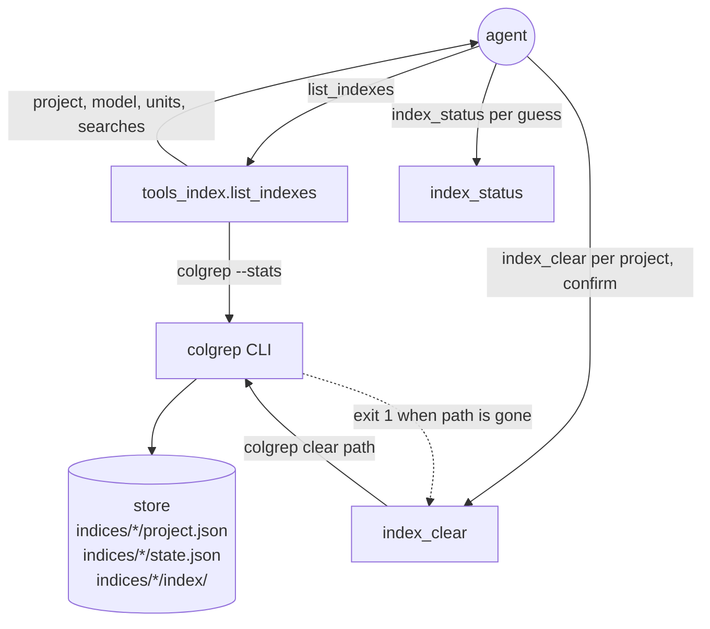
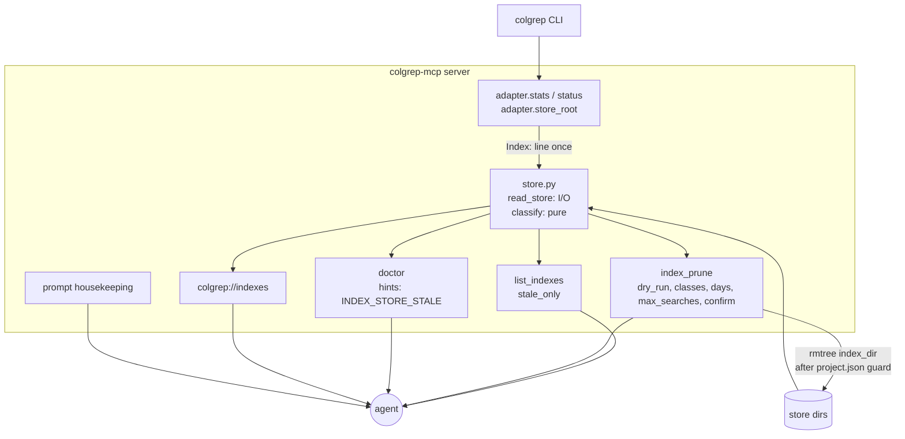

# Index housekeeping for colgrep-mcp — Architecture Analysis (v0)

Date: 2026-09-13. Report id `R01` (index_housekeeping) in the `AGENTS.md` legend.
Companion: `00-findings_clear_probe_v0.md` (`R02` (index_housekeeping)), the
probe this design rests on.

## Executive Summary

- **Problem.** colgrep's index store only grows. Measured on the maintainer's
  machine on 2026-09-13 (macOS, colgrep 1.6.2): 165 indexed projects, 3.3 GiB
  under the store; 65 indexes (0.92 GiB) name a `project_path` that no
  longer exists (48 are agent worktrees); about 15 index machine state
  (`/private/tmp` itself with 2 434 units, `~/.cache/uv/...`,
  `~/.claude/plugins/cache/...`, per-session scratchpads); dozens are
  *shadowed* — a subdirectory of another indexed project, double-indexing
  its units because colgrep only folds into an ancestor that was indexed
  first; 12 (0.06 GiB) are live but cold. `list_indexes` shows project,
  model, units and search count only: no size, no age, no path-exists, no
  shadowing. Cleaning up today costs an agent one `index_status` per guess
  and one confirmed `index_clear` per project — dozens of calls.
- **Proposed change.** Read the store directly (`project.json` + `state.json`
  per index directory, directory size and `state.json` mtime), classify
  every index (`orphaned`, `machine_state`, `shadowed`, `cold`, live), and
  expose that once: an enriched `list_indexes` / `colgrep://indexes` with a
  `stale_only` filter, a new `index_prune` tool (dry run by default,
  grouped candidates, `confirm=true` or elicitation to delete), a
  `housekeeping` prompt, a `doctor` hint when the store carries orphans or
  a machine-state root, and a skill section. Plus one `build(repo)` leaf:
  exclude `(PR #N)` merge subjects from the changelog.
- **The probe that shaped the adapter.** `colgrep clear <gone path>` exits 1
  with `Error: No such file or directory (os error 2)` and leaves the index
  directory in place (R02). Prune therefore deletes the index directory
  under the store itself, guarded by the directory's own `project.json`
  naming the path being pruned (C5).
- **Non-goals.** No per-session hook (hooks stay at bare-interpreter cost,
  harness_wiring R01 §C3). No change to `search`, `expand`, `index_build`,
  `index_clear`. No hard-coded platform store path (Windows differs). No
  attempt to rebuild or migrate indexes.
- **Biggest risks.** Deleting a directory a live project depends on — closed
  by the exact-`project.json` guard and by never issuing `colgrep clear`
  for a prune (the folding rule cannot bite a direct directory delete). A
  Windows path convention the classifier mis-reads — closed by the
  `machine_state_roots` drift test against the hook and by Windows CI.
- **Validation.** `fake_colgrep.py` gains a `FAKE_COLGREP_STORE` knob so a
  synthetic store under `tmp_path` drives `--stats` and `status`; pure
  classification tests with injected home/roots; tool tests through the
  in-memory client (dry run, confirm, elicitation accept/decline/failure,
  guard); the surface dump-and-diff (`list_tools`/`list_resources`/
  `list_prompts` JSON before and after) cited in the PR body.

## Current State



Every fact an agent needs to decide "is this index worth keeping" — does the
path still exist, how big is it, when was it last touched, is it inside
another indexed project — is on disk in the store, and none of it reaches
the agent.

## Proposed State



## Key Flows

```mermaid
sequenceDiagram
    participant A as agent
    participant P as index_prune
    participant S as store.py
    participant CG as colgrep
    participant FS as store dirs
    A->>P: index_prune() (dry_run=true)
    P->>CG: --stats
    P->>CG: status <first existing project>
    CG-->>P: Index: <store>/<dir>  → store root = parent
    P->>S: read_store(root) → entries; classify(entries, stats, ...)
    S-->>P: candidates grouped by class, sizes
    P-->>A: text table + structured candidates, "call again with dry_run=false, confirm=true"
    A->>P: index_prune(dry_run=false, confirm=true)
    P->>P: recompute candidates (never trust a stale list)
    loop each candidate
        P->>FS: re-read <index_dir>/project.json == candidate.project?
        P->>FS: rmtree(<index_dir>) under the project lock
    end
    P-->>A: pruned[], failed[], bytes freed; notifies colgrep://indexes
```

## Contracts & Invariants

### C1 — the store root is derived, never hard-coded

`store_root(adapter)`: take `adapter.stats()`, call `adapter.status()` on the
first project whose path exists, and use the parent of its `Index:` line.
Cached on the adapter for the process lifetime (the store does not move
under a running server). Returns `None` when no indexed project exists on
disk — then `list_indexes` degrades to today's four fields and
`index_prune` reports `[INDEX_STORE_UNKNOWN]` rather than guess a platform
path. The `Index:` line is already parsed (`textparse.parse_status`); no
new text format enters the adapter.

### C2 — one store entry per index directory

`store.read_store(root) -> list[StoreEntry]` reads every direct child
directory holding a `project.json`:

| Field | Source |
|:--|:--|
| `index_dir` | the child directory (absolute) |
| `project` | `project.json["project_path"]` |
| `model` | `project.json["model"]` |
| `files` | `len(state.json["files"])` |
| `search_count` | `state.json["search_count"]` |
| `size_bytes` | one `os.scandir` walk of the directory (15 ms for 165 indexes, measured) |
| `last_modified` | `state.json` mtime (colgrep rewrites it on every search), else the directory mtime |

A child without `project.json` is skipped, never an error: the store is
colgrep's, not ours. `state.json` is read whole (25 ms for 165 on the same
machine) — the file-hash map is the bulk of it and is not kept.

### C3 — classification is pure and ordered

`store.classify(entries, *, now, home, machine_roots, days, max_searches)`
assigns exactly one class per entry, first match wins:

| Class | Rule |
|:--|:--|
| `orphaned` | `project` does not exist on disk |
| `machine_state` | `project` is under a machine-state root (the system temp directory, `~/Library`, `~/AppData`) or has a dot-prefixed component under the home directory, **and** no ancestor up to the filesystem root carries a `.git` entry (Claude Code's own `.claude/worktrees/` are source corpora) |
| `shadowed` | `project` is a strict descendant of another entry's `project` that exists on disk; `shadowed_by` names it |
| `cold` | `search_count <= max_searches` and `last_modified` is at least `days` old |
| live | otherwise |

The machine-state roots are the hook's `machine_state_roots(home)`
(`hooks/colgrep_policy.py`) restated in the server — the hook is stdlib-only
and ships outside the PyPI package, so it cannot be imported — and a drift
test asserts both functions return the same list for the same home. The
`.git` walk costs one `lstat` per path component and runs only for the
handful of machine-state candidates, never for the 150 live entries.

### C4 — `list_indexes` grows, its block format is extended, its budget stays

`IndexInfo` gains optional fields, all `None` when the store root is
unknown or the project is absent from the store:

```text
IndexInfo: project, model, units_indexed, search_count,
           + path_exists: bool | None, size_bytes: int | None,
             last_modified: str | None (ISO 8601), shadowed_by: str | None,
             stale: "orphaned" | "machine_state" | "shadowed" | None
```

`stale` carries the parameter-free classes only; `cold` needs `days` and
`max_searches` and lives in `index_prune`. `list_indexes(stale_only=false)`
filters on `stale is not None`. The text block appends
`size=<MiB>  modified=<date>` and a trailing `[orphaned]` /
`[machine_state]` / `[shadowed by <project>]` tag; the header appends the
store total and the per-class counts. The renderer stays
`tools_search._render_budgeted` — the text budget landed in v0.2.0
(`fix(index): cap list_indexes text at the text budget like every other
renderer`), so the "missing budget" the campaign brief carried over is
already closed; this cycle changes only what the blocks say. Client-visible
shape change, pinned by tests (`maintainer-policy` §Client-visible).

`colgrep://indexes` serves the same enriched `IndexList`.

### C5 — `index_prune`

```text
index_prune(classes=["orphaned","machine_state","shadowed"],
            days=30, max_searches=1, dry_run=true, confirm=false)
  -> PruneResult(dry_run, store_root, candidates: [PruneCandidate], total_bytes,
                 pruned: [project], failed: [project], freed_bytes)
PruneCandidate: project, index_dir, class, size_bytes, last_modified,
                search_count, shadowed_by
```

- `dry_run=true` (default) lists candidates grouped by class with sizes and
  ends with the exact next call. `cold` is opt-in through `classes`.
- `dry_run=false` recomputes the candidates (a list from an earlier call is
  advice, not a contract), then deletes only with `confirm=true` or an
  accepted elicitation — the `index_clear` flow verbatim: no elicitation
  capability → `[CONFIRMATION_REQUIRED]`; the elicitation call itself
  failing → `[CONFIRMATION_REQUIRED]`; declined → `pruned=[]`, text
  "Not pruned (declined)".
- Deletion is `store.remove_index_dir(root, index_dir, project)` — in the
  store module, not the adapter, because it touches the store's layout and
  never the binary: the directory must be a direct child of the store root,
  and its `project.json` must name `project` at the moment of deletion;
  otherwise the candidate lands in `failed` and nothing is removed. Never `colgrep clear`: for a shadowed
  or a gone path that command either fails (R02) or clears the ancestor
  project that folded the path (colgrep_mcp R05 D3) — the exact failure
  `index_clear`'s `PROJECT_ROOT_MISMATCH` exists to prevent. Each removal
  runs under `project_lock(project)`.
- After any deletion, `colgrep://indexes` is notified once.

### C6 — `doctor` hints

`Doctor` gains `hints: list[str]` (the `problems` list keeps meaning "not
ok"). When the store root is known and the classification finds orphaned or
machine-state entries, one hint is appended:
`[INDEX_STORE_STALE] <n> orphaned, <m> machine-state indexes (<MiB>) …`.
`Code.INDEX_STORE_STALE` and `Code.INDEX_STORE_UNKNOWN` join `errors.HINTS`
and so `colgrep://errors`. `INDEX_STORE_UNKNOWN` is hinted only when
`--stats` lists projects and none exists on disk — a machine with no index
at all gets no hint. `doctor` already spawns `--version` and
`settings`; this adds `--stats`, one `status` and the store read (~40 ms).

### C7 — `housekeeping` prompt and skill section

`housekeeping(days="30")` beside `explore`/`locate`/`impact`: (1)
`list_indexes(stale_only=true)`; (2) `index_prune()` dry run, review the
grouped table, decide whether `cold` belongs in `classes`; (3)
`index_prune(dry_run=false, confirm=true, classes=[...])`; (4) re-run
`list_indexes` to confirm. The prompt has no `path` argument, so
`complete_path` is untouched. `skills/colgrep-search/SKILL.md` gains a
decision-table row and a "housekeeping" workflow; `guide.md` gains the tool
and the classes; both READMEs' Tools tables gain the row (`test_readme`).

### C8 — changelog excludes merge subjects

`changelog_pattern` becomes
`^(?!.*\(PR #\d+\)$)(feat|fix|perf|BREAKING CHANGE)(\(.+\))?(!)?`:
commitizen applies it with `re.match` to the commit subject
(`changelog.generate_tree_from_commits`), so a negative lookahead anchored at
the start excludes a subject ending in `(PR #N)`. Oracle: `cz changelog
--dry-run` for a released version before and after; the diff must remove
exactly the duplicated `(PR #N)` lines (`maintainer-policy` §Drift tests).
`test_changelog.py` stays green (headings untouched).

### Error model

| Situation | Surface |
|:--|:--|
| no indexed project exists on disk | `list_indexes`: four legacy fields, others `None`; `index_prune`, `doctor`: `[INDEX_STORE_UNKNOWN]` (prune raises it, doctor lists it as a hint) |
| a candidate's `project.json` changed or vanished before deletion | `failed` entry, nothing removed, tool succeeds |
| `rmtree` fails (permissions, a file held open) | `failed` entry with the OS error text, other candidates proceed |
| `dry_run=false` without confirmation | `[CONFIRMATION_REQUIRED]`, as `index_clear` |

## Alternatives Considered

| Decision | Options | Chosen | Why |
|:--|:--|:--|:--|
| D1 How prune removes an index | (a) `colgrep clear <path>`; (b) delete the index directory under the store | (b) | R02: `clear` exits 1 on a gone path and leaves the directory; for a shadowed path it would clear the folding ancestor. (b) removes exactly the directory whose `project.json` names the candidate. |
| D2 Store root | (a) platform default path per OS; (b) an env var; (c) parent of the `Index:` line of one `status` call | (c) | No platform table to keep right for Windows; no new configuration surface; the parser already exists. Degrades explicitly when no indexed project exists on disk. |
| D3 Where classification lives | (a) inside `tools_index.py`; (b) a new `store.py` with I/O (`read_store`) and pure logic (`classify`) apart | (b) | Mirrors the `adapter.py` / `textparse.py` split: a classification bug is never mistaken for an I/O bug, and the pure half is tested with injected home/roots so Windows CI's temp-under-home layout cannot flip a result. |
| D4 Machine-state convention | (a) import the hook; (b) restate the roots in the server and pin with a drift test; (c) move the hook into the package | (b) | (a) impossible across distributions; (c) rejected already for hook latency (harness_wiring D2). |
| D5 Sizes | (a) eager `scandir` per index on every call; (b) lazy / opt-in | (a) | Measured 15 ms for 165 indexes; size is the field the change exists for. |
| D6 Age source | (a) index directory mtime; (b) `state.json` mtime; (c) `project.json` mtime | (b) | colgrep rewrites `state.json` on every search (`search_count`), so it is the last-use time; the directory mtime coincides in practice and is the fallback. |
| D7 Class exposure in `list_indexes` | (a) four booleans; (b) one `stale` field with the parameter-free classes | (b) | One field to filter on (`stale_only`); `cold` needs parameters and belongs to `index_prune`. |
| D8 Prune defaults | (a) all four classes; (b) `cold` opt-in | (b) | Orphaned, machine-state and shadowed indexes are dead weight by construction; a cold live project is a judgement the agent should make with the numbers in front of it. |
| D9 Hook or doctor | (a) a `SessionStart` hook that warns about the store; (b) a `doctor` hint | (b) | Hooks must stay at bare-interpreter cost and carry the rule only (harness_wiring R01 §C3, §C4); `doctor` is the self-check an agent runs when something looks off. |
| D10 Roadmap tree | (a) `dirtree-rdm`; (b) step commits | (b) | Single implementer, every leaf lead-sized, precedent `pypi_publication` and `harness_wiring` D9. |
| D11 Text budget for `list_indexes` | (a) add it; (b) nothing | (b) | Already landed in v0.2.0; the brief's premise was stale. Recorded here so the next cycle does not carry it again. |

## Risks & Mitigations

| # | Risk | Likelihood | Mitigation |
|:--|:--|:--|:--|
| 1 | Prune deletes a directory a live project uses | low | C5 guard: direct child of the store root, `project.json` equals the candidate at deletion time; `shadowed` deletes the descendant, never the ancestor; `colgrep clear` never used by prune. |
| 2 | Windows: the runner's temp directory sits under the home directory, so a `tmp_path` project reads as machine state | certain in CI | Pure tests inject `home`/`machine_roots`; tool tests use `orphaned` (path-independent) or monkeypatch `store.machine_state_roots`; Windows CI verdict read in full (`campaign-lead`). |
| 3 | No indexed project exists on disk, so the store root cannot be derived | low | Explicit `[INDEX_STORE_UNKNOWN]`; `list_indexes` still answers with the legacy fields. |
| 4 | The enriched block breaks a client that parsed the old line | low | Fields are appended, the first four tokens are unchanged; pinned by the updated format test. |
| 5 | `state.json` grows large on big projects (file-hash map), so the read pass is not free | low | 25 ms for 165 on the maintainer's machine; only `files` length and `search_count` are kept. |
| 6 | `changelog_pattern` drops a genuine entry | low | Dry-run diff before/after shows only `(PR #N)` lines removed. |

## Roadmap Recommendation

No roadmap tree (D10). Step commits, one concern each, on this branch:

1. `docs(reports): record the index housekeeping architecture and the clear probe`
2. `feat(index): read the colgrep store and enrich list_indexes with size, age, path and shadowing` — `store.py`, models, adapter store-root cache, `fake_colgrep.py` knob, tests, resource.
3. `feat(index): add index_prune to remove orphaned, machine-state, shadowed and cold indexes` — tool, adapter `remove_index_dir`, error codes, tests.
4. `feat(prompts): add the housekeeping prompt and a doctor hint for a stale index store`
5. `docs(skill): teach the housekeeping workflow in the search skill, guide and READMEs`
6. `build(repo): exclude merge subjects ending in (PR #N) from the changelog`
