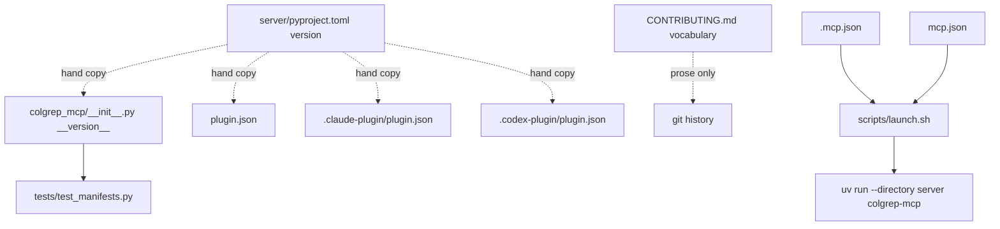
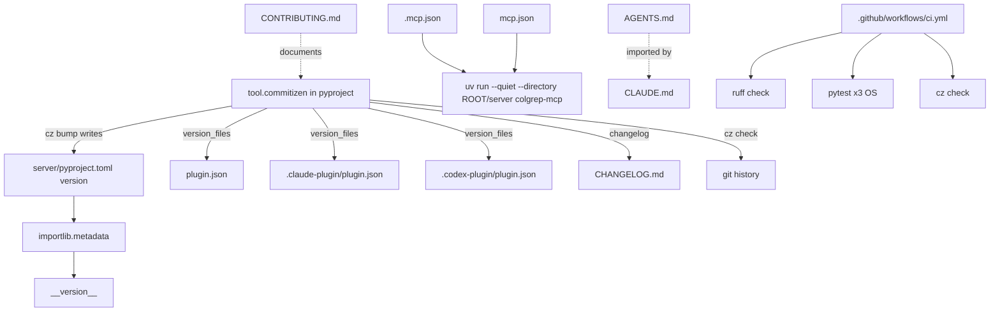

# repo_health — Architecture Analysis (v0)

Date: 2026-09-12

## Executive Summary
- **Problem**: colgrep-mcp 0.1.0 works, but the repository scaffold has four sources of friction for the agents that will maintain it: (1) the version number is hand-copied into four files; (2) versioning and changelog are manual prose with no machinery, so `CONTRIBUTING.md` is the only ground truth and nothing checks a commit against it; (3) the server is launched through `scripts/launch.sh`, which cannot run on Windows and, when the repo's own `.mcp.json` is picked up as a *project* config, fails outright because `${CLAUDE_PLUGIN_ROOT}` is not expanded there (observed in this session: `posix_spawn '${CLAUDE_PLUGIN_ROOT}/scripts/launch.sh'`); (4) there is no repo-level orientation file for agents, and 27 fully-merged branches from the 0.1.0 campaign clutter `git branch`.
- **Proposed change**: one version source with machinery around it (`importlib.metadata` + commitizen configured to the existing CONTRIBUTING vocabulary); launch through `uv run … colgrep-mcp` from every manifest; an `AGENTS.md` (imported by `CLAUDE.md`) that tells a cold agent where things live and which commands are gates; a lint gate (ruff, check only); a minimal cross-OS CI workflow; branch cleanup.
- **Non-goals**: no changes to server behaviour or tool surface; no PyPI publish (the launcher is designed so `uvx colgrep-mcp` is a one-line change later); no `ruff format` sweep this cycle (churn vs. two parallel branches); no blocking git hooks; no GitHub remote creation.
- **Biggest risks**: plugin ecosystems differ on where `${PLUGIN_ROOT}`-style placeholders may appear; commitizen's `cz_customize` must reproduce the CONTRIBUTING vocabulary exactly or the machinery contradicts the docs; `uv` must be on the client's PATH (the shell script's PATH rebuild is being removed on purpose).
- **Validation approach**: the existing pytest suite plus new drift tests (version = pyproject, manifests launch via `uv`); `cz check` over the real history; `cz bump --dry-run`; `claude --plugin-dir . mcp list` and `claude mcp list` from the repo root for both launch contexts; a reviewer pass over the merged diff before release.

## Current State

## Proposed State

## Contracts & Invariants

### C1 — Version
- `server/pyproject.toml` `[project].version` is the **only** place a human or agent edits a version, and even that only through `cz bump`.
- `colgrep_mcp.__version__` = `importlib.metadata.version("colgrep-mcp")`; fallback `"0.0.0+unknown"` only when the distribution is absent (never under `uv run`, which installs the project editable).
- Invariant, tested: `__version__ == pyproject version == every manifest version`.
- `cz bump` rewrites pyproject + the three manifests (`version_files`) + `CHANGELOG.md` and tags `v<new>`; bump commit subject `release(colgrep-mcp): v<new>` (matches the existing `v0.1.0` commit).

### C2 — Commit machinery
- Vocabulary = the table already in `CONTRIBUTING.md`: `feat`→minor, `fix`→patch, `perf`→patch, `refactor`/`test`/`docs`/`build`/`chore`→none, `release` (bump commits only), `BREAKING CHANGE:` footer→major. Scope **mandatory**, kebab-case.
- Encoded as `[tool.commitizen]` + `[tool.commitizen.customize]` in `server/pyproject.toml`; `uv run cz check --rev-range v0.1.0..HEAD` passes; `uv run cz bump --dry-run` predicts the next version from the history alone.
- Changelog sections map to Keep-a-Changelog headings (`feat`→Added, `fix`→Fixed, `perf`→Changed) so generated entries sit beside the hand-written 0.1.0 entry; `changelog_incremental = true`.
- Enforcement is **advisory locally, mandatory in CI**: no git hook (agents commit; a hook that blocks is friction), CI runs `cz check` over the PR range. `CONTRIBUTING.md` says so.

### C3 — Launch
- Every manifest launches the same argv: `uv run --quiet --directory <ROOT>/server colgrep-mcp`, where `<ROOT>` is the ecosystem's own placeholder (`${CLAUDE_PLUGIN_ROOT}`, `${PLUGIN_ROOT}`) placed in `args`, never in `command`.
- `scripts/launch.sh` is deleted. The PATH-rebuild it did is replaced by documentation: `uv` must be on the client's PATH, or the client config names it by absolute path.
- The root `.mcp.json` must not break Claude Code when the repo itself is the project: either it works in both contexts (verified with `claude --plugin-dir . mcp list` **and** `claude mcp list` run from the repo root) or it is moved out of the auto-loaded location and the manifests updated accordingly.
- Error model unchanged: the server still fails fast on malformed env; `doctor` still reports the colgrep binary.

### C4 — Agent orientation
- `AGENTS.md` at the root: repo map, the five gate commands, conventions pointer, dispatch checklist, known traps (from `__reports__/colgrep_mcp/03-knowledge_transfer_v0.md`). `CLAUDE.md` contains only `@AGENTS.md`. The landing `README.md` stays human-facing and gains one line pointing agents at `AGENTS.md`.

### C5 — Lint
- `[tool.ruff]` in `server/pyproject.toml`, `line-length = 120`, `target-version = "py311"`, rules `E F I UP B`; `uv run ruff check` clean. No `ruff format` this cycle.

## Alternatives Considered
| Decision | Options | Chosen | Why |
|:--|:--|:--|:--|
| Version machinery | python-semantic-release; commitizen; hand-maintained | commitizen | Offline, config lives in the pyproject agents already edit, `version_files` covers the JSON manifests, `cz check` doubles as the commit linter; semantic-release is GitHub-release-oriented and this repo has no remote yet |
| Launch command | keep `launch.sh` + add `.cmd`; `python -m colgrep_mcp`; `uv run … colgrep-mcp` | `uv run` | Manifests can name one command; `uv` is already the documented prerequisite and exists on all three OSes; `python` is not reliably on PATH on Windows/macOS; `uvx colgrep-mcp` becomes a one-line swap after PyPI |
| Commit enforcement | pre-commit hook; CI only; none | CI + documented local command | Agent-authored commits; a blocking hook costs a retry loop, CI gives the same guarantee later |
| Formatter | ruff format now; later | later | Two branches touch tests in parallel this cycle; a format sweep is a one-commit follow-up |
| Agent docs file | CLAUDE.md only; AGENTS.md + CLAUDE.md import | AGENTS.md + import | Codex and Agent Plugins clients read `AGENTS.md`; Claude Code reads `CLAUDE.md`; one body of text |

## Risks & Mitigations
| # | Risk | Mitigation |
|:--|:--|:--|
| 1 | Agent Plugins 1.0 forbids placeholders in `args` as well as `command` | Implementer reads the spec first; fallback is a relative `--directory ./server` plus a documented cwd assumption, recorded as a deviation |
| 2 | `cz_customize` cannot express "scope mandatory" or the `release` type | `schema_pattern` is a regex; verify with `cz check` against the 74 existing commits, list any that fail and why |
| 3 | Removing the PATH rebuild breaks GUI-launched clients whose PATH lacks `uv` | README troubleshooting entry with the absolute-path recipe; `claude --plugin-dir . mcp list` gate still run from a terminal |
| 4 | Two depth-0 branches both edit `server/pyproject.toml` or `test_manifests.py` | Leaves are file-disjoint by construction: `python_tooling` owns pyproject, `__init__.py`, a new `test_version.py`, CONTRIBUTING; `launcher` owns manifests, `test_manifests.py`, README, `scripts/` |
| 5 | `uv run` does not refresh editable metadata after a version bump, so `__version__` lags | The drift test compares against pyproject; `uv sync` is part of the documented release recipe |

## Roadmap Recommendation
Tier 2 roadmap at `__roadmap__/repo_health/`: two parallel leaves (`python_tooling`, `launcher`), then an `integrate/` level (`agent_docs`, `ci_workflow`, `review`), then `integrate/release/` (`cleanup_and_release`).
