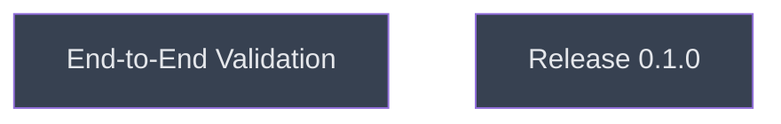

# Verify

## Context
Depth 4, the last level. Validates the assembled server against the real colgrep binary on a real repository, records measurements, then cuts release 0.1.0.

## Goal
Prove the server works end-to-end and release it.

## Pre-conditions
- [ ] `server_assembly` and `docs_readme` done and merged

## Success Gates
- ⬜ [behavioral] Findings report with measured latencies exists under `__reports__/colgrep_mcp/`
- ⬜ [static] `git tag v0.1.0` exists on the milestone branch after merge to main

## Status

## Nodes
| Node | Type | Status |
|:-----|:-----|:-------|
| `e2e_validation.md` | 📄 Leaf Task | ⬜ Planned |
| `release_0_1_0.md` | 📄 Leaf Task | ⬜ Planned |

## Amendment Log
| ID | Date | Source | Nodes Added | Rationale |
|:---|:-----|:-------|:------------|:----------|

## Progress
| Node | Branch | Commits | Notes |
|:-----|:-------|:--------|:------|
