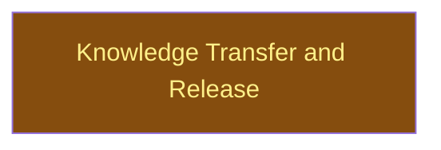

# Close

## Context
The last level: after the review and the surface leaf, write the retrospective and cut the release from the main checkout.

## Goal
v0.2.0 on `main` with the knowledge-transfer report committed and every worktree and merged branch removed.

## Pre-conditions
- [ ] `integrate/review` and `integrate/surface` done; PR opened from the campaign branch and CI green on three OSes

## Success Gates
- ✅ [run] `git tag --contains` shows `v0.2.0` on `main`; `claude plugin install colgrep-mcp-dev@colgrep-mcp` would resolve (marketplace validates)
- ✅ [static] `__reports__/dev_plugin/03-knowledge_transfer_v0.md` exists with Next-cycle Changes

## Status

## Nodes
| Node | Type | Status |
|:-----|:-----|:-------|
| `knowledge_transfer.md` | 📄 Leaf Task | 🔄 In Progress |

## Amendment Log
| ID | Date | Source | Nodes Added | Rationale |
|:---|:-----|:-------|:------------|:----------|

## Progress
| Node | Branch | Commits | Notes |
|:-----|:-------|:--------|:------|
