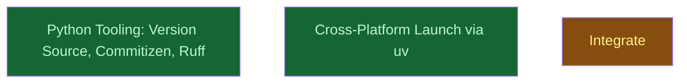

# repo_health

## Context
Second campaign of this repository, after `colgrep_mcp` shipped 0.1.0. Consumes R01 (repo_health architecture) and the 0.1.0 retrospective; produces a repository whose version, changelog, launch path and agent orientation are mechanical rather than hand-maintained, so future LLM agents can drive releases and updates without re-deriving conventions. Server behaviour and tool surface are out of scope.

## Goal
Make the repository scaffold mechanical and cross-platform: one version source with commitizen machinery, `uv`-based launch in every manifest, an `AGENTS.md`, a lint gate, a cross-OS CI workflow, and a cleaned branch list — then release 0.1.1 through the new machinery.

## Pre-conditions
- [ ] `cd server && uv run pytest` passes on `main` at `v0.1.0` (193 passed, 1 skipped on 2026-09-12)
- [ ] `uv` ≥ 0.9, `claude` CLI, `git` available; `uvx --from commitizen cz version` prints a version
- [ ] R01 `__reports__/repo_health/00-architecture_v0.md` exists and is committed before any leaf is dispatched

## Success Gates
- ✅ [run] `cd server && uv run pytest` passes; `uv run ruff check` clean; `uv run cz check --rev-range v0.1.0..HEAD` passes
- ✅ [run] `uv run cz bump --dry-run` (from `server/`) prints the next version derived from history and the files it would touch
- ✅ [static] no `scripts/launch.sh`; every manifest launches `uv run --quiet --directory <ROOT>/server colgrep-mcp`
- ✅ [behavioral] `claude --plugin-dir . mcp list` shows the colgrep server connected; `claude mcp list` from the repo root does not report a broken `colgrep` entry
- ✅ [static] `AGENTS.md` and `CLAUDE.md` exist at the root; `.github/workflows/ci.yml` runs ruff, pytest on ubuntu/macos/windows, and `cz check`
- ✅ [run] `git branch --merged main` lists no `task/*`, `milestone/*` or `worktree-agent-*` branch from the 0.1.0 campaign
- ✅ [static] `CHANGELOG.md` has a `0.1.1` section generated by `cz bump`; tag `v0.1.1` exists on `main`

## Gotchas
- The two depth-0 leaves are file-disjoint on purpose (R01 Risk 4): `python_tooling` owns `server/pyproject.toml`, `server/uv.lock`, `server/colgrep_mcp/__init__.py`, new `server/tests/test_version.py`, `CONTRIBUTING.md`; `launcher` owns `.mcp.json`, `mcp.json`, `.codex-plugin/plugin.json`, `scripts/`, `server/tests/test_manifests.py`, `README.md`. Do not cross.
- Manifest `version` fields stay `0.1.0` until the release leaf bumps them.
- Worktrees are created from HEAD: commit the leaf files before dispatching (0.1.0 retrospective).

## Status

## Nodes
| Node | Type | Status |
|:-----|:-----|:-------|
| `python_tooling.md` | 📄 Leaf Task | ✅ Done |
| `launcher.md` | 📄 Leaf Task | ✅ Done |
| `integrate/` | 📁 Directory | 🔄 In Progress |

## Amendment Log
| ID | Date | Source | Nodes Added | Rationale |
|:---|:-----|:-------|:------------|:----------|

## Progress
| Node | Branch | Commits | Notes |
|:-----|:-------|:--------|:------|
| `python_tooling.md` | `task/python_tooling` | 4 | cz check passes over all 79 commits; `cz bump --dry-run --increment PATCH` → 0.1.1; ruff 22 → 0 |
| `launcher.md` | `task/launcher` | 3 | option (b): Claude Code MCP config moved to `.claude-plugin/mcp.json`; `claude --plugin-dir . mcp list` connected; project context lists nothing |
